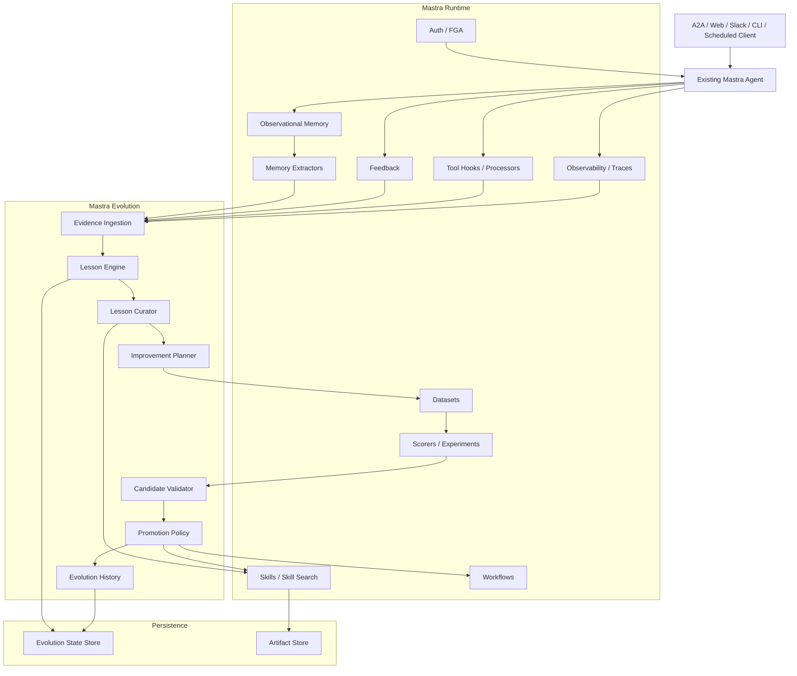
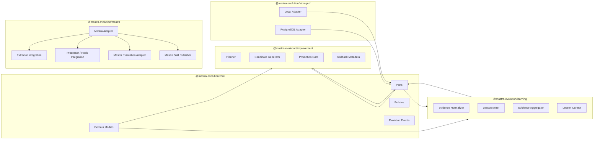
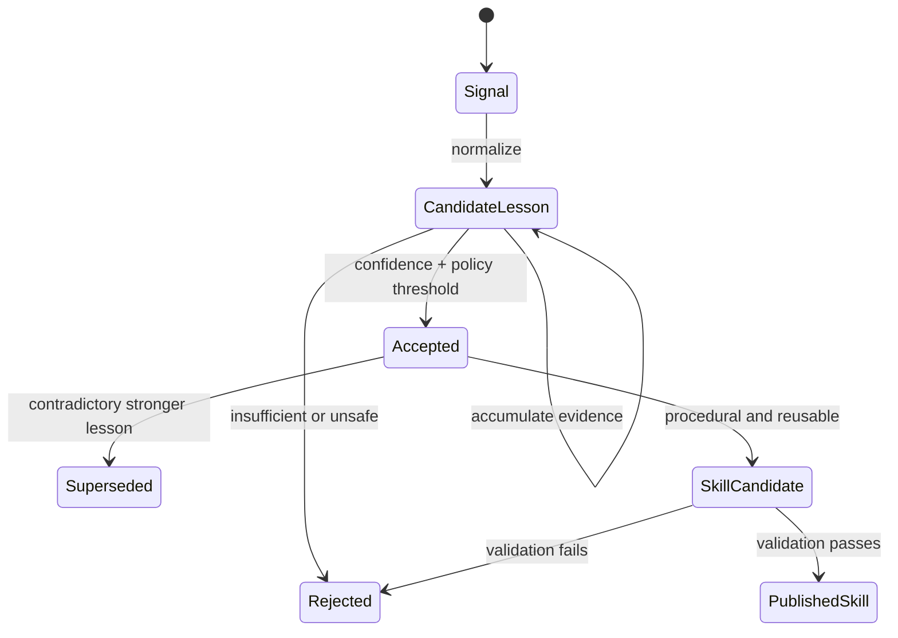
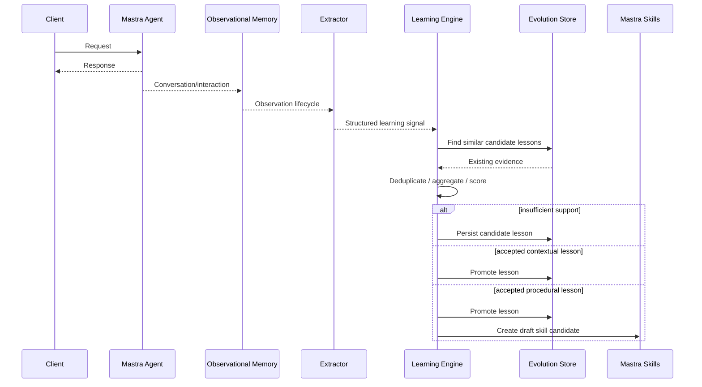
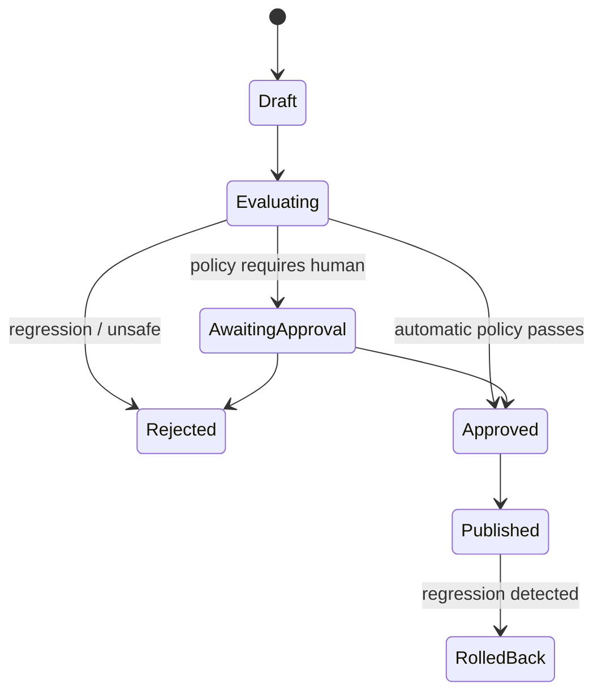
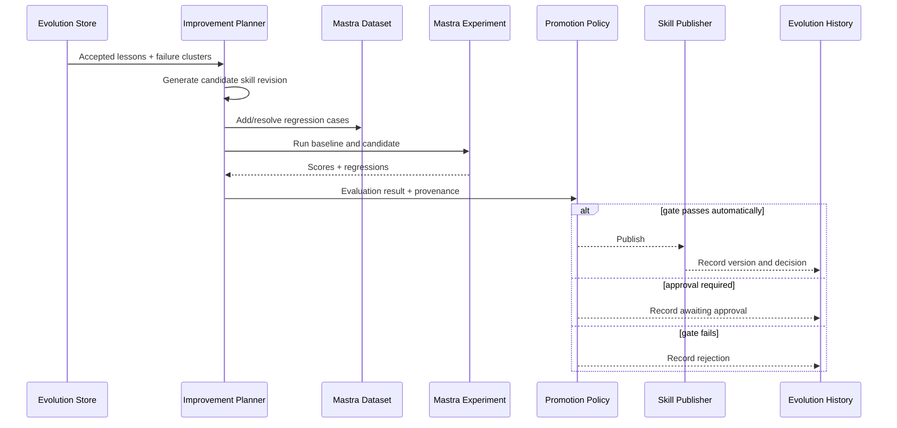
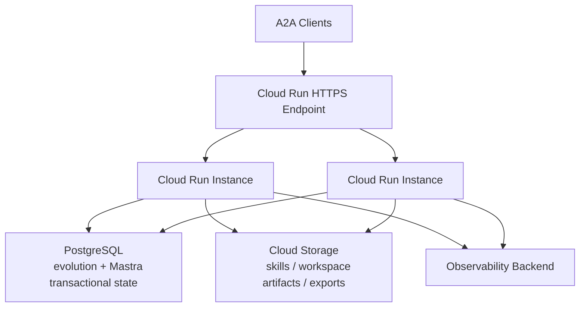
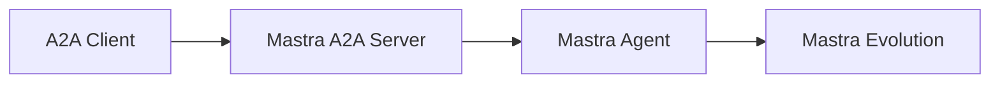

# RFC: Mastra Evolution — Self-Learning and Self-Improvement for Mastra Agents

**Repository:** `yu-iskw/mastra-evolution`  
**Status:** Draft  
**Date:** 2026-08-31  
**Audience:** Mastra application developers, platform engineers, agent engineers, enterprise AI platform teams

---

## Executive Summary

Mastra Evolution is a proposed TypeScript library that adds **self-learning** and **self-improvement** capabilities to existing Mastra agents without replacing Mastra's agent runtime, memory, skills, A2A, storage, evaluation, authorization, observability, workspaces, or workflows.

The core design decision is:

> **Mastra owns execution and agent infrastructure; Mastra Evolution owns the evidence-driven evolution loop.**

The library should let developers independently enable:

1. **Self-learning**: convert production interactions, corrections, failures, feedback, tool outcomes, and observations into durable, scoped, provenance-preserving lessons and reusable Mastra skills.
2. **Self-improvement**: turn accumulated lessons into explicit improvement proposals, evaluate candidate changes against production-derived regression datasets, and promote or reject them according to configurable autonomy and governance policies.

The library must support a continuum from a hobbyist using one local process and a local database to a company running multi-user A2A agents on Cloud Run with database-backed state, immutable artifact storage, auditability, approval gates, authorization, and rollback.

The library should be **Mastra-native but architecturally adapter-based** so Mastra API churn is isolated to a compatibility layer. Core domain concepts such as `Lesson`, `Evidence`, `ImprovementProposal`, `PromotionPolicy`, and `EvolutionEvent` should not depend directly on Mastra types.

The MVP should deliberately avoid autonomous source-code modification. It should begin with the safest, most inspectable evolution target: **Mastra skills**.

---

# 1. Problem Statement

Developers can already build capable agents using Mastra. Mastra provides primitives for memory, tools, skills, workspaces, A2A, evaluation, observability, workflows, storage, security, and other runtime concerns.

What Mastra does not presently provide as one integrated product abstraction is a closed lifecycle that continuously turns real-world usage into agent improvements:

```text
USE
 ↓
OBSERVE
 ↓
LEARN
 ↓
PROPOSE
 ↓
EVALUATE
 ↓
PROMOTE
 ↓
USE
```

Hermes Agent demonstrates the value of agents that preserve useful knowledge and improve procedural behavior over time. However, directly porting Hermes into TypeScript would duplicate many Mastra capabilities and create a competing agent framework.

Mastra Evolution should instead provide the missing **evolution control plane**.

---

# 2. User Intent

## 2.1 Primary users

### Individual developer

A hobbyist or independent developer should be able to install Mastra Evolution and get durable learning without provisioning a distributed platform.

Desired experience:

```bash
npm install @mastra-evolution/core @mastra-evolution/mastra
```

and a local persistence profile.

### Application developer

An application developer may already have a Mastra agent used from:

- A2A
- web UI
- Slack
- CLI
- internal API
- scheduled workflows
- another agent

They should be able to attach learning and improvement independently without rebuilding the interaction layer.

### Enterprise platform team

A company may run shared or per-user A2A agents and require:

- tenant isolation
- authentication and authorization
- provenance
- approval gates
- audit history
- rollback
- production evaluations
- multi-instance correctness
- policy enforcement
- observability
- compliance retention

The same conceptual APIs should work under this deployment model.

---

# 3. Goals

## 3.1 Functional goals

Mastra Evolution SHALL:

1. Attach to an existing Mastra agent without requiring a custom agent runtime.
2. Allow self-learning and self-improvement to be enabled separately.
3. Collect learning evidence from Mastra-native sources.
4. Normalize evidence into a stable framework-neutral representation.
5. Generate and aggregate `Lesson` objects.
6. Scope learned information to thread, user/resource, team, agent, or organization boundaries.
7. Preserve provenance for every durable learned artifact.
8. Generate Mastra-compatible skills from sufficiently supported procedural lessons.
9. Generate explicit improvement proposals rather than silently mutating production behavior.
10. Evaluate candidate changes with Mastra datasets, scorers, and experiments where applicable.
11. Support configurable promotion policies and autonomy levels.
12. Track version and rollback metadata.
13. Provide local zero/low-infrastructure defaults.
14. Support multi-instance enterprise deployments.
15. Be resilient to Mastra version changes via an adapter/capability layer.

## 3.2 Non-functional goals

The library SHOULD prioritize:

- small public API surface
- composability
- safe defaults
- explicit scopes
- deterministic audit history
- failure isolation
- observability
- testability
- low coupling
- backwards-compatible domain contracts
- graceful capability degradation

---

# 4. Non-Goals

The initial library SHALL NOT:

- implement a replacement Mastra `Agent`
- implement its own A2A server
- implement its own MCP runtime
- implement its own general memory subsystem
- replace Observational Memory
- define a proprietary skill format
- implement a new vector database
- implement its own authentication framework
- replace Mastra authorization
- replace Mastra observability
- replace Mastra datasets/scorers/experiments
- replace Mastra workspace or sandbox APIs
- directly mutate application source code in the MVP
- treat arbitrary user statements as globally trusted knowledge

---

# 5. XY Problem Analysis

## 5.1 Naive framing

A naive implementation would reproduce Hermes-style memory, reflection, skills, and agent modification in TypeScript.

This is the wrong boundary.

## 5.2 Mastra capabilities that should remain Mastra's responsibility

Mastra already provides or substantially addresses:

| Concern | Mastra capability | Mastra Evolution ownership |
|---|---|---|
| Conversation persistence | Memory | No |
| Long-term compressed context | Observational Memory | No |
| Structured extraction | Memory Extractors | No |
| Procedural artifacts | Skills | No format duplication |
| Skill retrieval | `SkillSearchProcessor` | No |
| Workspace filesystem | Workspace | No |
| Skill/workspace persistence | Mastra storage domains | No |
| Evaluation | Scorers | No |
| Regression cases | Datasets | No |
| Candidate comparison | Experiments | No |
| Tool interception | Tool hooks/processors | No |
| A2A | Mastra A2A | No |
| Authorization | Mastra auth/FGA | No |
| Observability | Mastra observability/OTel | No |
| Long-running execution | Workflows | No |
| Dynamic workflow definitions | Dynamic workflows | No |
| Token limits | Token limiter processors | No |
| Sandbox/filesystem | Workspace/Sandbox | No |
| Evidence → lesson | Not a complete native lifecycle | **Yes** |
| Lesson aggregation | Not a complete native lifecycle | **Yes** |
| Improvement proposal | Not a complete native lifecycle | **Yes** |
| Promotion policy | Not a complete native lifecycle | **Yes** |
| Evolution provenance | Partial infrastructure only | **Yes** |
| Autonomy policy | Not a complete native lifecycle | **Yes** |

The library should therefore orchestrate Mastra primitives rather than duplicate them.

---

# 6. External Evidence Affecting the Design

## 6.1 Observational Memory

Mastra's Observational Memory uses observer/reflector agents to maintain dense observation logs while retaining a predictable context structure. Mastra reports 84.23% with GPT-4o and 94.87% with GPT-5-mini on the published LongMemEval evaluation.

Design implication:

> Mastra Evolution should consume Observational Memory and its lifecycle hooks rather than implement another conversation summarization or long-term-memory pipeline.

Reference:

- https://mastra.ai/research/observational-memory

## 6.2 Memory Extractors

Mastra Memory Extractors can extract typed structured data using schemas as part of the Observational Memory background processing path.

Design implication:

> Learning-signal extraction should preferentially reuse Extractors so the system does not make redundant post-turn LLM calls solely to rediscover information Mastra is already processing.

Reference:

- https://mastra.ai/blog/introducing-memory-extractors

## 6.3 Skills and Skill Search

Mastra provides first-class skills and `SkillSearchProcessor`, supporting BM25/vector/hybrid search and lazy loading of relevant skills.

Design implication:

> Mastra Evolution must emit Mastra-compatible skill artifacts and must not invent a parallel skill registry or retrieval system.

Reference:

- https://mastra.ai/blog/introducing-skill-search-processor

## 6.4 Datasets and Experiments

Mastra datasets provide versioned test cases and experiments compare target behavior using scorers.

Design implication:

> Real production failures and corrections can become regression test cases. Candidate improvements should be compared with the current baseline before promotion.

References:

- https://mastra.ai/blog/introducing-datasets
- https://mastra.ai/blog/mastra-experiments

## 6.5 Mastra API evolution

Mastra has already introduced breaking changes, including a change to the Observational Memory `observe()` signature in February 2026.

Design implication:

> Direct Mastra API usage must be concentrated inside a compatibility adapter rather than spread throughout the domain model.

Reference:

- https://mastra.ai/blog/changelog-2026-02-13

## 6.6 Cloud Run + Cloud Storage FUSE

Cloud Run can mount Cloud Storage buckets directly. Cloud Storage FUSE does not provide file locking for concurrent writes and is not fully POSIX compliant.

Design implication:

> A GCS mount is appropriate for immutable or versioned skill/workspace artifacts, exports, and blobs. It is not the recommended persistence layer for SQLite/LibSQL or other transactional mutable state in multi-instance deployments.

Reference:

- https://docs.cloud.google.com/run/docs/configuring/services/cloud-storage-volume-mounts

---

# 7. Architectural Principles

## P1. Evolution is orchestration, not execution

Mastra remains responsible for running agents.

Mastra Evolution observes, learns, proposes, evaluates, and publishes.

## P2. Learning and improvement are separate capabilities

A developer MUST be able to enable learning without enabling self-modification.

## P3. No implicit global learning

Every lesson has an explicit scope.

## P4. Every durable change has evidence

No learned skill or production change should exist without provenance.

## P5. Production mutation is policy-controlled

The library creates proposals; promotion behavior is separately configurable.

## P6. Local first, distributed when needed

A one-user setup must not require PostgreSQL, Redis, queues, or Kubernetes.

## P7. Mastra APIs are adapters

Core domain types must remain mostly framework-neutral.

## P8. Prefer immutable evolution history

Evolution history should behave like an append-only control plane even if the underlying current-state tables are mutable.

---

# 8. System Architecture



---

# 9. Internal Software Architecture



---

# 10. Proposed Repository Layout

Because the repository is currently empty, this RFC defines the initial structure.

```text
mastra-evolution/
├── .github/
│   └── workflows/
├── docs/
│   ├── architecture/
│   └── examples/
├── examples/
│   ├── local-learning/
│   ├── local-self-improvement/
│   └── cloud-run-a2a/
├── packages/
│   ├── core/
│   ├── learning/
│   ├── improvement/
│   ├── mastra/
│   ├── presets/
│   ├── storage-local/
│   ├── storage-postgres/
│   └── testing/
├── RFC.md
├── package.json
├── pnpm-workspace.yaml
├── tsconfig.base.json
└── vitest.workspace.ts
```

Recommended tooling:

- TypeScript
- pnpm workspaces
- Changesets
- Vitest
- ESLint
- Prettier
- tsup or equivalent library bundling
- API Extractor or TypeScript declaration checks if needed

Exact build tooling should remain replaceable.

---

# 11. Package Responsibilities

## 11.1 `@mastra-evolution/core`

Contains stable framework-neutral contracts.

MUST NOT import Mastra runtime APIs unless unavoidable.

Responsibilities:

- `Evidence`
- `Lesson`
- `LearningSignal`
- `ImprovementProposal`
- `EvolutionEvent`
- `Scope`
- `AutonomyLevel`
- storage ports
- evaluator ports
- publisher ports
- clock/id abstractions
- policy contracts

## 11.2 `@mastra-evolution/learning`

Responsibilities:

- signal normalization
- lesson creation
- lesson deduplication
- evidence accumulation
- confidence calculation
- lesson promotion lifecycle
- procedural-skill candidate creation
- contradiction handling
- poisoning safeguards

It must work without self-improvement enabled.

## 11.3 `@mastra-evolution/improvement`

Responsibilities:

- identify recurring improvement opportunities
- build candidate changes
- construct evaluation plans
- invoke evaluator ports
- produce promotion verdicts
- maintain rollback metadata
- enforce autonomy policies

## 11.4 `@mastra-evolution/mastra`

The only package that should know detailed Mastra integration APIs.

Responsibilities:

- consume Observational Memory extractors/hooks
- map Mastra trace/feedback/tool data into `Evidence`
- integrate with Mastra skill storage/workspaces
- integrate with datasets/scorers/experiments
- expose Mastra-native processors/hooks/workflows
- probe supported capabilities
- isolate Mastra version differences

## 11.5 `@mastra-evolution/presets`

Provides batteries-included configurations:

- `localLearningPreset`
- `localEvolutionPreset`
- `cloudRunPreset`
- `enterpriseGovernedPreset`

Presets must be optional.

## 11.6 `@mastra-evolution/storage-local`

Provides local storage suitable for:

- hobby users
- examples
- development
- single-process agent runtime

It may use a local filesystem and/or LibSQL-compatible implementation, but the abstraction must not assume that a local file database is valid in distributed deployments.

## 11.7 `@mastra-evolution/storage-postgres`

Provides transactional state suitable for:

- multiple Cloud Run instances
- shared A2A agents
- enterprise deployments
- concurrent learners

## 11.8 `@mastra-evolution/testing`

Provides:

- synthetic evidence builders
- deterministic policies
- fake publishers
- fake evaluators
- evolution scenario harness
- regression test helpers

---

# 12. Core Domain Model

## 12.1 Scope

```ts
export type EvolutionScope =
  | { type: "thread"; threadId: string }
  | { type: "resource"; resourceId: string }
  | { type: "team"; teamId: string }
  | { type: "agent"; agentId: string }
  | { type: "organization"; organizationId: string };
```

Scope must always be explicit for durable lessons.

## 12.2 Evidence

```ts
export interface Evidence {
  id: string;
  agentId: string;
  scope: EvolutionScope;

  source:
    | "interaction"
    | "feedback"
    | "tool-call"
    | "tool-result"
    | "trace"
    | "memory-extractor"
    | "evaluation";

  kind:
    | "correction"
    | "success"
    | "failure"
    | "preference"
    | "fact"
    | "procedure"
    | "missing-capability"
    | "policy-signal";

  summary: string;

  provenance: {
    threadId?: string;
    resourceId?: string;
    traceId?: string;
    spanId?: string;
    runId?: string;
  };

  observedAt: Date;
}
```

Evidence content containing sensitive source material should support redaction and reference-based storage.

## 12.3 Lesson

```ts
export interface Lesson {
  id: string;
  agentId: string;
  scope: EvolutionScope;

  kind:
    | "fact"
    | "preference"
    | "procedure"
    | "correction"
    | "failure-pattern"
    | "success-pattern"
    | "missing-capability";

  statement: string;

  evidenceIds: string[];

  confidence: number;
  occurrenceCount: number;

  firstObservedAt: Date;
  lastObservedAt: Date;

  status:
    | "candidate"
    | "accepted"
    | "rejected"
    | "superseded";

  suggestedAction?:
    | "memory"
    | "create-skill"
    | "update-skill"
    | "instruction-change"
    | "workflow-change"
    | "none";
}
```

## 12.4 Improvement Proposal

```ts
export interface ImprovementProposal {
  id: string;
  agentId: string;

  scope: EvolutionScope;

  reason: string;
  lessonIds: string[];
  evidenceIds: string[];

  target:
    | { type: "skill"; skillId?: string }
    | { type: "instructions" }
    | { type: "workflow"; workflowId: string }
    | { type: "tool-policy"; toolId?: string };

  baselineRevision?: string;

  candidateArtifact: unknown;

  evaluation?: {
    baselineScore?: number;
    candidateScore?: number;
    regressions: string[];
    verdict: "pass" | "fail" | "inconclusive";
  };

  status:
    | "draft"
    | "evaluating"
    | "awaiting-approval"
    | "approved"
    | "rejected"
    | "published"
    | "rolled-back";

  createdAt: Date;
  updatedAt: Date;
}
```

---

# 13. Learning Signal Model

Mastra Memory Extractors should produce normalized learning candidates where possible.

Suggested schema:

```ts
export const learningSignalSchema = z.object({
  kind: z.enum([
    "correction",
    "preference",
    "failure",
    "success",
    "procedure",
    "missing-capability",
  ]),

  summary: z.string(),

  importance: z.number().min(0).max(1),
  confidence: z.number().min(0).max(1),

  suggestedScope: z.enum([
    "thread",
    "resource",
    "team",
    "agent",
    "organization",
  ]),

  suggestedAction: z.enum([
    "retain",
    "create-skill",
    "update-skill",
    "instruction-change",
    "workflow-change",
    "none",
  ]),
});
```

The extractor's suggestion is advisory. Scope promotion and artifact publication remain policy decisions.

---

# 14. Learning Lifecycle



Important property:

> A single user interaction does not automatically become organization-level durable behavior.

---

# 15. Learning Sequence



---

# 16. Self-Improvement Lifecycle

Self-improvement is a higher-risk capability than self-learning and must be separately enabled.



---

# 17. Improvement Sequence



---

# 18. Production Feedback as Regression Tests

A central product feature should be converting production experience into a continuously improving evaluation corpus.

Sources include:

- explicit user corrections
- negative feedback
- failed tool execution
- incorrect tool arguments
- human overrides
- repeated retries
- successful procedural sequences
- organization-approved examples

Example:

```text
User correction:
"When I say revenue, use booked revenue excluding cancellations."

          ↓

Evidence

          ↓

Lesson

          ↓

Regression dataset case

          ↓

Future skill/prompt candidates must continue passing it
```

This prevents the self-improvement loop from forgetting previously solved production failures.

---

# 19. Autonomy Levels

The library should use explicit autonomy levels rather than a boolean `selfImproving: true`.

| Level | Name | Behavior |
|---|---|---|
| L0 | Observe | Capture evidence only |
| L1 | Learn | Create/aggregate lessons |
| L2 | Recommend | Generate candidate changes only |
| L3 | Validate | Generate and evaluate changes; require approval |
| L4 | Auto-Promote Bounded | Automatically publish allowed artifact classes after gates |
| L5 | Autonomous Evolution | Broad automatic modification |

Recommended defaults:

### Hobby preset

- learning: L1
- skill improvement: L4
- instruction improvement: L2
- workflow improvement: disabled
- code improvement: disabled

### Enterprise preset

- learning: L1
- skill improvement: L3
- instruction improvement: L3
- workflow improvement: L2/L3
- tool authorization changes: never autonomous
- code improvement: disabled by default

---

# 20. Evolution Targets

Recommended implementation order:

| Phase | Target | Default automation |
|---|---|---|
| v0.1 | Skill creation/update | Bounded |
| v0.2 | Few-shot examples / prompt fragments | Governed |
| v0.3 | Agent instructions | Governed |
| v0.4 | Dynamic workflow definitions | Governed |
| v0.5 | Tool-selection policies | Strictly governed |
| Future | Source-code PR generation | Human merge required |

The MVP SHALL NOT automatically modify:

- credentials
- authentication
- authorization rules
- secrets
- deployment permissions
- network configuration
- arbitrary application source
- security boundaries

---

# 21. Poisoning and Trust Model

Self-learning introduces a durable poisoning channel.

Threat:

```text
malicious input
   ↓
learning signal
   ↓
durable lesson
   ↓
published skill
   ↓
future users affected
```

Required mitigations:

1. Preserve source identity and scope where available.
2. Do not automatically promote resource-level evidence to organization scope.
3. Require configurable minimum evidence counts.
4. Support trusted-source weighting.
5. Detect contradictions.
6. Support lesson expiry/decay where appropriate.
7. Treat policy/security instructions as non-learnable by default.
8. Prevent learned content from modifying authorization boundaries.
9. Add adversarial evaluation cases before organization-wide publication.
10. Provide complete rollback history.

---

# 22. Tenant Isolation

A lesson belongs to an explicit logical scope.

```text
thread
  ↓
resource/user
  ↓
team
  ↓
agent
  ↓
organization
```

Promotion across boundaries must be explicit.

Example:

```text
Alice corrects analytics terminology
          ↓
Alice-scoped lesson

NOT automatically:

organization-wide skill
```

An optional `ScopePromotionPolicy` can decide when evidence from multiple independent users warrants promotion.

---

# 23. Public API Direction

The public API should avoid requiring a custom `Agent` subclass.

Preferred direction:

```ts
const learning = createLearning({
  agentId: "analytics-agent",
  autonomy: "learn",
});

const improvement = createImprovement({
  agentId: "analytics-agent",
  autonomy: "validate",
});
```

The Mastra adapter should expose integration fragments:

```ts
const integration = createMastraEvolution({
  agent,
  learning,
  improvement,
});
```

Exact ergonomics should be prototyped against Mastra's current APIs.

Avoid:

```ts
new SelfImprovingAgent(...)
```

because it makes Mastra Evolution responsible for preserving Agent runtime semantics.

---

# 24. Port Interfaces

## 24.1 State store

```ts
export interface EvolutionStore {
  putEvidence(evidence: Evidence): Promise<void>;
  findEvidence(query: EvidenceQuery): Promise<Evidence[]>;

  putLesson(lesson: Lesson): Promise<void>;
  getLesson(id: string): Promise<Lesson | undefined>;
  findLessons(query: LessonQuery): Promise<Lesson[]>;

  putProposal(proposal: ImprovementProposal): Promise<void>;
  getProposal(id: string): Promise<ImprovementProposal | undefined>;

  appendEvent(event: EvolutionEvent): Promise<void>;
}
```

## 24.2 Evaluator

```ts
export interface ImprovementEvaluator {
  evaluate(
    proposal: ImprovementProposal,
    context: EvaluationContext,
  ): Promise<ImprovementEvaluation>;
}
```

## 24.3 Publisher

```ts
export interface EvolutionPublisher {
  publish(
    proposal: ApprovedImprovementProposal,
  ): Promise<PublishedRevision>;
}
```

## 24.4 Approval provider

```ts
export interface ApprovalProvider {
  requestApproval(
    proposal: ImprovementProposal,
  ): Promise<ApprovalDecision>;
}
```

These ports keep the core independently testable.

---

# 25. Mastra Adapter Contract

The Mastra adapter should expose capability detection.

```ts
export interface MastraCapabilities {
  observationalMemory: boolean;
  memoryExtractors: boolean;
  skills: boolean;
  skillSearch: boolean;
  versionedSkills: boolean;
  feedback: boolean;
  datasets: boolean;
  experiments: boolean;
  toolHooks: boolean;
  dynamicWorkflows: boolean;
  fineGrainedAuthorization: boolean;
}
```

The adapter should use feature/capability detection wherever feasible instead of hard-coded version checks.

Compatibility policy:

- support a documented Mastra version range
- test minimum and latest supported versions
- isolate API shims
- fail with actionable capability errors
- degrade gracefully for optional capabilities

Example:

```text
Extractors unavailable
        ↓
fallback evidence processor

Experiments unavailable
        ↓
candidate publication requires external evaluator or remains proposed
```

---

# 26. Persistence Profiles

## 26.1 Hobby/local

Recommended:

```text
Mastra process
  ├─ local Mastra storage / LibSQL
  ├─ local evolution state
  └─ local workspace/skills
```

Characteristics:

- zero external infrastructure
- single writer
- easy backup
- ideal for examples and personal use

## 26.2 Cloud Run single-user convenience profile

Possible:

```text
Cloud Run
  ├─ agent
  ├─ database-backed learning state
  └─ GCS-mounted or remote workspace artifacts
```

Even if a service is intentionally limited to one instance, transactional state should not be designed around assuming Cloud Storage FUSE behaves like a POSIX local disk.

## 26.3 Enterprise

Recommended:

```text
Cloud Run / other compute
       │
       ├─ PostgreSQL: transactional evolution state
       │
       └─ GCS/Object store: immutable/versioned artifacts
```

The library must not hard-code PostgreSQL. It should support storage ports.

---

# 27. Cloud Run Deployment



Cloud Storage FUSE limitations relevant to this design:

- no file locking for concurrent writes
- last writer wins for replacement
- not fully POSIX compliant

Therefore:

> Do not put a multi-writer SQLite/LibSQL database on a GCS mount.

Use GCS for artifacts or Mastra remote workspace data where its semantics are appropriate.

---

# 28. A2A Integration

Mastra Evolution should be transport-agnostic.



Mastra Evolution should consume normalized run/thread/resource/trace context.

It should not parse A2A protocol messages directly unless Mastra exposes no appropriate integration surface.

This allows the same agent to learn from:

- A2A
- HTTP
- chat
- workflows
- scheduled invocations

without different learning implementations.

---

# 29. Reliability Requirements

## 29.1 Idempotency

Evidence ingestion must be idempotent.

Every event should have a deterministic source identity where possible.

## 29.2 Concurrency

Distributed workers must not independently publish conflicting revisions.

Use optimistic concurrency/version checks or transaction-level coordination through the state store.

## 29.3 Partial failures

Failure to learn must never fail the user's agent response by default.

Recommended execution semantics:

```text
agent response succeeds
      ↓
learning pipeline fails
      ↓
record error
      ↓
retry independently
```

Exceptions may be configurable for synchronous test environments.

## 29.4 Rollback

Every published improvement must include:

- previous revision
- candidate revision
- evidence set
- evaluation result
- publisher
- timestamp
- policy decision

---

# 30. Observability

Mastra Evolution should create its own structured evolution telemetry while integrating with Mastra/OpenTelemetry.

Recommended metrics:

- evidence ingested
- candidate lessons created
- lessons accepted/rejected
- lesson contradiction rate
- skill candidates generated
- proposals generated
- evaluations run
- candidate regression rate
- promotions
- rollbacks
- mean evidence count before promotion
- cost per accepted lesson
- cost per promoted improvement
- latency added to user path
- asynchronous processing lag

Recommended trace spans:

```text
evolution.ingest
evolution.lesson.mine
evolution.lesson.aggregate
evolution.proposal.generate
evolution.evaluate
evolution.promote
evolution.rollback
```

---

# 31. Security and Privacy

## 31.1 Data minimization

Evidence should store references to raw interaction content where possible rather than duplicating complete transcripts.

## 31.2 Secrets

Extractors and learning prompts must be instructed not to preserve secrets.

Support pluggable redactors before durable persistence.

## 31.3 Authorization

Mastra Evolution must not invent a parallel authorization model.

It should consume authenticated identity/resource context from Mastra and respect Mastra authorization boundaries.

## 31.4 Sensitive artifact classes

The following should require explicit policy overrides:

- organization-wide instruction updates
- workflow mutation
- tool permissions
- external side-effect configuration

## 31.5 Auditability

All decisions must produce append-only audit events.

---

# 32. Evaluation Policy

A candidate change should never be evaluated solely on average reward.

Minimum evaluator dimensions should support:

- task correctness
- known regression cases
- safety constraints
- tool correctness
- latency
- token/cost delta
- hallucination rate where measurable
- policy compliance

A default skill gate could be:

```text
candidate correctness >= baseline
AND
no critical regression
AND
targeted failure cases improve
AND
cost increase <= configured threshold
```

Exact scoring is application-specific.

---

# 33. Promotion Policy

Example contract:

```ts
export interface PromotionPolicy {
  decide(
    proposal: ImprovementProposal,
    evaluation: ImprovementEvaluation,
    context: PromotionContext,
  ): Promise<
    | { decision: "publish" }
    | { decision: "request-approval"; reason: string }
    | { decision: "reject"; reason: string }
  >;
}
```

Policies should be composable.

Example enterprise policy chain:

```text
EvidenceThresholdPolicy
      ↓
ScopePolicy
      ↓
RegressionPolicy
      ↓
SecurityPolicy
      ↓
ApprovalPolicy
```

---

# 34. Contradiction Handling

Durable learning needs an explicit contradiction lifecycle.

Example:

```text
Lesson A:
"Use dataset X."

Later evidence:
"Dataset X was retired. Use dataset Y."

       ↓

contradiction detected

       ↓

A marked superseded
B becomes candidate/accepted
```

Do not merely append both facts to a prompt.

Suggested metadata:

- supersedes lesson ID
- conflict confidence
- temporal validity
- source trust
- scope

---

# 35. Learning Decay and Temporal Knowledge

Not all lessons are timeless.

Optional validity metadata:

```ts
validity?: {
  validFrom?: Date;
  validUntil?: Date;
  revalidateAfter?: Date;
};
```

Examples requiring expiration/revalidation:

- API versions
- organization processes
- current on-call procedures
- temporary user preferences
- infrastructure topology

The default should not assume every lesson decays; policies should choose.

---

# 36. Skill Evolution

Skills are the recommended MVP evolution artifact.

Skill publication should support:

```text
lesson cluster
    ↓
draft skill
    ↓
static validation
    ↓
Mastra dataset evaluation
    ↓
promotion policy
    ↓
published skill revision
```

A skill artifact should embed or link to:

- originating lesson IDs
- proposal ID
- revision metadata
- evaluation ID
- generated timestamp

The skill's user-visible/runtime content should remain compatible with Mastra/Agent Skills conventions.

---

# 37. Human Approval

Approval is not part of learning itself.

Human approval is a promotion concern.

The library should expose an `ApprovalProvider` abstraction.

Initial implementations could include:

- callback/manual API
- CLI approval
- webhook adapter
- application UI adapter

A future enterprise adapter could integrate external change-management systems.

---

# 38. Developer Experience

## 38.1 Local learning only

Target ergonomics:

```ts
const evolution = createMastraEvolution({
  learning: {
    enabled: true,
  },
  improvement: {
    enabled: false,
  },
});
```

## 38.2 Self-improvement

```ts
const evolution = createMastraEvolution({
  learning: {
    enabled: true,
  },
  improvement: {
    enabled: true,
    autonomy: "validate",
    targets: ["skill"],
  },
});
```

## 38.3 Enterprise

```ts
const evolution = createMastraEvolution({
  store: postgresEvolutionStore(...),

  learning: {
    enabled: true,
    scopePolicy: enterpriseScopePolicy(...),
  },

  improvement: {
    enabled: true,
    autonomy: "validate",
    promotionPolicy: enterprisePromotionPolicy(...),
  },
});
```

These snippets are conceptual API direction, not final API commitments.

---

# 39. Alternatives Considered

## Alternative A: Hermes-style independent framework

### Pros

- total control
- framework portability

### Cons

- duplicates Mastra memory, skills, evaluation, A2A, persistence
- high maintenance
- poor ecosystem fit

### Decision

Reject.

---

## Alternative B: Custom `SelfImprovingAgent` subclass/wrapper

### Pros

- simple marketing/API story
- easy onboarding

### Cons

- risks shadowing Mastra agent semantics
- streaming and future runtime features become wrapper responsibilities
- high coupling

### Decision

Do not make this the primary architecture.

A convenience helper may exist later if it delegates entirely to Mastra-native integration.

---

## Alternative C: Processor-only implementation

### Pros

- very Mastra-native
- small footprint

### Cons

- cross-session and long-running improvement workflows do not naturally fit entirely inside processors
- promotion and evaluation are broader than a request pipeline

### Decision

Use processors/hooks as integration mechanisms, not as the entire architecture.

---

## Alternative D: External centralized learning service

### Pros

- enterprise governance
- multi-agent learning
- central audit

### Cons

- too much infrastructure for hobby users
- operationally heavy

### Decision

Support as a deployment pattern through the same ports later, not as the core requirement.

---

## Alternative E: Evolution runtime + Mastra adapter

### Pros

- strong Mastra reuse
- portable domain model
- suitable for hobby and enterprise
- upgrade churn isolated
- explicit governance

### Cons

- more concepts than a one-line wrapper
- requires disciplined package boundaries

### Decision

**Recommended.**

---

# 40. Decision Matrix

| Approach | Mastra Alignment | Upgrade Resilience | Learning Quality | Hobby UX | Enterprise Governance | Extensibility | Weighted Result |
|---|---:|---:|---:|---:|---:|---:|---:|
| Hermes port | 30 | 45 | 83 | 75 | 65 | 85 | 61 |
| Agent wrapper | 72 | 50 | 79 | 95 | 67 | 70 | 72 |
| Processor-only | 92 | 83 | 72 | 89 | 78 | 78 | 82 |
| **Evolution runtime** | **97** | **91** | **96** | **91** | **96** | **96** | **94** |
| Central service | 83 | 90 | 95 | 25 | 99 | 99 | 80 |

Weights assumed:

- Mastra alignment: 20%
- upgrade resilience: 15%
- learning quality: 20%
- hobby UX: 10%
- enterprise governance: 20%
- extensibility: 15%

---

# 41. Testing Strategy

## 41.1 Unit tests

Test:

- evidence normalization
- scope enforcement
- lesson deduplication
- contradiction resolution
- confidence rules
- policy composition
- proposal state machine
- rollback metadata

## 41.2 Contract tests

Every storage adapter must pass the same contract suite.

Every evaluator adapter must pass the same lifecycle suite.

## 41.3 Mastra compatibility tests

CI matrix should cover:

- minimum supported Mastra version
- latest supported Mastra version
- optionally canary/pre-release in non-blocking CI

## 41.4 Integration tests

Scenarios:

1. correction produces candidate lesson
2. repeated correction promotes lesson
3. procedural lesson creates draft skill
4. generated skill is discovered by Mastra Skill Search
5. regression test prevents bad skill update
6. scope prevents user lesson leaking to organization
7. concurrent proposal publication detects version conflict
8. learner failure does not fail agent request

## 41.5 Adversarial tests

Include:

- prompt injection attempting to rewrite system behavior
- malicious instructions attempting organization-wide promotion
- contradictory sources
- repeated spam evidence
- compromised low-trust user
- secret leakage attempts
- evaluation gaming
- cross-tenant contamination

---

# 42. CI/CD

Initial repository CI should include:

```text
lint
typecheck
unit tests
package build
Mastra compatibility tests
example compilation
```

Release workflow:

```text
changeset
   ↓
version PR
   ↓
CI
   ↓
npm publish
```

No direct publication from arbitrary feature branches.

---

# 43. Versioning

Mastra Evolution should use Semantic Versioning.

Mastra compatibility should be explicit in documentation:

```text
Mastra Evolution 0.x
supported @mastra/core:
>= X < Y
```

The Mastra adapter may have a faster release cadence than core.

Breaking Mastra changes should not force breaking changes to `Lesson` or `ImprovementProposal` unless semantics truly change.

---

# 44. Rollout Plan

## Phase 0 — Foundations

Implement:

- monorepo
- domain types
- ports
- local storage
- Mastra adapter skeleton
- compatibility checks
- test harness

## Phase 1 — Self-learning MVP

Implement:

```text
Mastra interaction
   ↓
Extractor/evidence
   ↓
Lesson
   ↓
Evidence accumulation
   ↓
Accepted lesson
```

No automatic skill publication yet.

## Phase 2 — Skill learning

Implement:

```text
procedural lesson
   ↓
draft Mastra skill
   ↓
validation
   ↓
publish
```

## Phase 3 — Evaluated self-improvement

Implement:

```text
production failure
   ↓
dataset regression case
   ↓
skill candidate
   ↓
baseline/candidate experiment
   ↓
promotion policy
```

## Phase 4 — Enterprise governance

Add:

- PostgreSQL adapter
- distributed concurrency controls
- approval provider
- scope promotion policies
- richer audit APIs
- Cloud Run example

## Phase 5 — Additional evolution targets

Consider:

- instructions
- dynamic workflows
- tool selection policies
- coding-agent-generated PR proposals

---

# 45. MVP Acceptance Criteria

The first compelling end-to-end release should demonstrate:

1. A normal existing Mastra agent is used without subclass replacement.
2. A client submits an interaction.
3. Mastra Observational Memory/Extractor produces a structured signal.
4. Mastra Evolution persists evidence.
5. Multiple related observations are aggregated into one lesson.
6. The lesson becomes an accepted procedural lesson.
7. A draft Mastra-compatible skill is generated.
8. Production-derived regression cases are assembled.
9. Baseline and candidate are evaluated.
10. Promotion policy accepts the candidate.
11. The new skill becomes discoverable to the agent.
12. A later request successfully uses the learned skill.
13. The entire chain has provenance and can be rolled back.

Success means this loop works:

```text
USE
 ↓
LEARN
 ↓
CHANGE
 ↓
EVALUATE
 ↓
PROMOTE
 ↓
USE BETTER
```

---

# 46. Open Questions

## Q1. Should `Lesson` be public API?

Recommendation: **Yes.**

It is the most important framework-neutral semantic object in the system.

## Q2. Should core support frameworks other than Mastra immediately?

Recommendation: **No.**

Keep the ports framework-neutral but optimize the first implementation for Mastra.

## Q3. Should learning always be asynchronous?

Recommendation:

- production default: asynchronous/non-blocking
- test/local mode: configurable synchronous execution

## Q4. Should skills be stored by Mastra or Mastra Evolution?

Recommendation:

> Mastra should own runtime skill artifacts. Mastra Evolution owns provenance and proposal metadata.

## Q5. Should organization-wide learning be automatic?

Recommendation:

> Not by default. Require cross-user corroboration and/or governance policy.

## Q6. Should source-code improvement be included?

Recommendation:

> Not before skill/prompt/workflow evolution is proven. Future code modifications should generate PRs, not directly modify production code.

## Q7. Should GCS be the default Cloud Run persistence layer?

Recommendation:

> Only for artifacts/blobs/workspace files. Do not use GCS FUSE as the transactional database substrate.

---

# 47. Major Risks

## Risk 1 — Mastra changes rapidly

Mitigation:

- adapter boundary
- capability detection
- compatibility CI
- minimal direct Mastra type leakage

## Risk 2 — Learning degrades the agent

Mitigation:

- evidence thresholds
- datasets
- experiments
- regression gates
- bounded autonomy
- rollback

## Risk 3 — Persistent prompt poisoning

Mitigation:

- provenance
- scope
- trust weighting
- sanitization
- promotion policies
- adversarial evaluation

## Risk 4 — Cross-tenant contamination

Mitigation:

- mandatory scopes
- resource-aware storage
- no implicit scope promotion
- authorization context propagation

## Risk 5 — Hobby UX becomes enterprise-heavy

Mitigation:

- local storage preset
- no required queue
- no required vector DB
- optional database adapters
- batteries-included presets

## Risk 6 — Library duplicates Mastra features over time

Mitigation:

Adopt a formal rule:

> When Mastra gains a sufficiently strong native primitive, deprecate the overlapping Mastra Evolution implementation and adapt to Mastra rather than preserve duplication.

---

# 48. Recommended Initial Decision

Adopt the following architecture as the repository baseline:

```text
@mastra-evolution/core
          │
          ├── @mastra-evolution/learning
          ├── @mastra-evolution/improvement
          │
          └── ports
                 │
        @mastra-evolution/mastra
                 │
             Mastra runtime

storage adapters remain behind ports
```

Start with **skills as the only automatically mutable artifact class**.

Self-learning and self-improvement remain independently configurable.

All durable learning is scoped and provenance-backed.

All automatic production improvement is evaluated and policy-gated.

---

# 49. Next Implementation Actions

1. Scaffold the TypeScript monorepo and define `core` contracts without implementing Mastra-specific behavior.
2. Implement a Mastra compatibility spike covering Observational Memory Extractors, skills/Skill Search, datasets, experiments, feedback, and tool hooks.
3. Build the first vertical slice:
   `interaction → evidence → lesson → generated skill → experiment → publication → future skill use`.
4. Add local persistence and the first runnable example.
5. Add PostgreSQL and Cloud Run only after the single-process lifecycle is correct.
6. Maintain a `MASTRA_CAPABILITIES.md` compatibility inventory so new Mastra releases can be assessed without redesigning the library.

---

# References

- Mastra Observational Memory research: https://mastra.ai/research/observational-memory
- Mastra Observational Memory announcement: https://mastra.ai/blog/observational-memory
- Mastra Memory Extractors: https://mastra.ai/blog/introducing-memory-extractors
- Mastra Skill Search Processor: https://mastra.ai/blog/introducing-skill-search-processor
- Mastra Datasets: https://mastra.ai/blog/introducing-datasets
- Mastra Experiments: https://mastra.ai/blog/mastra-experiments
- Mastra Observational Memory API breaking change: https://mastra.ai/blog/changelog-2026-02-13
- Mastra Observational Memory reliability notes: https://mastra.ai/blog/changelog-2026-02-24
- Cloud Run Cloud Storage volume mounts: https://docs.cloud.google.com/run/docs/configuring/services/cloud-storage-volume-mounts
