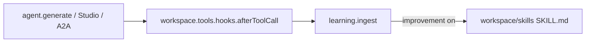

# 1. Agent-first workspace attach

Date: 2026-08-31

## Status

Accepted

## Context

Mastra developers already construct `Agent` with `workspace` and `memory`. Evolution must plug into that instance without a second `workspace` argument, without constructor-fragment spreads (`forAgent()`), and without subclassing `Agent`.

Mastra does not document a post-construction Agent hook setter. Workspace does document `getToolsConfig` / `setToolsConfig`. Per-call `generate`/`stream` hooks work but are easy to forget and are not used by Studio/A2A.

## Decision

`createMastraEvolution({ agent, learning: true })` is the public plug:

- Infer workspace from `agent.workspace` (`options.workspace` wins if both are set).
- Merge `afterToolCall` into workspace `tools.hooks` by reading `getToolsConfig`, composing hooks (existing first), and writing `setToolsConfig`. Do not drop `requireApproval` or per-tool keys.
- Infer hobby `LocalEvolutionStore` at a sibling `.evolution/` of `LocalFilesystem.basePath`.
- When improvement is on, publish Agent Skills under the workspace `skills` path. Do not set `skillSource`.
- Keep `applyToCall` as an escape hatch for assigned/non-workspace tools.
- Keep `register` as identity (`Object.is`). Do not wrap `generate`/`stream`.

## Consequences

Default evidence ingress is workspace tools only. Assigned tools need `applyToCall` or constructor `hooks`. Observational Memory extractors remain an advanced `extractor()` helper for apps that still construct `Memory`.
