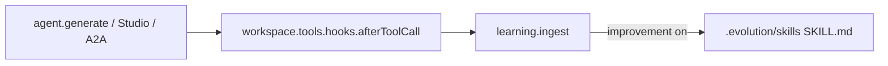

# 1. Agent-first workspace attach

Date: 2026-08-31

## Status

Accepted

Amended by [5. Evolution layer ownership on existing Mastra agents](0005-evolution-layer-ownership-on-existing-mastra-agents.md)

## Context

Mastra developers already construct `Agent` with `workspace` and `memory`. Evolution must plug into that instance without constructor-fragment spreads (`forAgent()`), and without subclassing `Agent`. Mastra 1.63 stores workspace as a private field (`#workspace`); the public reader is async `getWorkspace()`, so the sync factory takes the same Workspace object as `workspace`.

Mastra documents Agent constructor `hooks` (`beforeToolCall` / `afterToolCall`) and Workspace `tools.hooks` with `getToolsConfig` / `setToolsConfig`. There is no documented post-construction Agent hook setter. Attach uses **workspace** hook merge so Studio and A2A turns still capture tool failures without per-call `applyToCall`. Per-call `generate`/`stream` hooks remain an escape hatch. Ownership of Agent / Memory / Workspace vs the Evolution store is normative in [ADR-0005](0005-evolution-layer-ownership-on-existing-mastra-agents.md).

## Decision

`createMastraEvolution({ agent, workspace, learning: true })` is the public plug:

- Pass the same `Workspace` as `workspace`. Duck-typed `agent.workspace` still works; `options.workspace` wins if both are set.
- Merge `afterToolCall` into workspace `tools.hooks` by reading `getToolsConfig`, composing hooks (existing first), and writing `setToolsConfig`. Do not drop `requireApproval` or per-tool keys.
- Infer hobby `LocalEvolutionStore` at a sibling `.evolution/` of `LocalFilesystem.basePath`.
- When improvement is on, publish Agent Skills under `{storeDirectory}/skills` (sibling `.evolution/skills`). Keep git-managed skills under `{basePath}/skills` and list both on `Workspace({ skills })` via `resolveEvolutionWorkspaceLayout` (include `LocalFilesystem.allowedPaths`). `createMastraEvolution` warns if the bound Workspace cannot discover the learned root. Do not set `skillSource`.
- Keep `applyToCall` as an escape hatch for assigned/non-workspace tools.
- Keep `register` as identity (`Object.is`). Do not wrap `generate`/`stream`.

## Consequences

Default workspace `afterToolCall` ingest is **failures only**; successful list/read/search tool results are not journaled into the Evolution store. Assigned tools still need `applyToCall` or Agent constructor `hooks` for failure capture. Observational Memory extractors (and explicit `onExtracted` / `/evolution/extract`) remain the primary path for procedures and corrections. See [ADR-0005](0005-evolution-layer-ownership-on-existing-mastra-agents.md) for the full ownership table and non-goals (learning subagent as default, Feedback as skill author).
