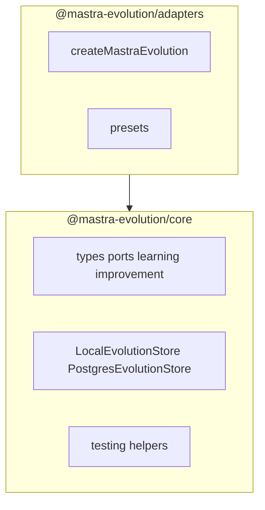

# 2. Two published packages

Date: 2026-08-31

## Status

Accepted

## Context

The library started as eight publishable workspace packages (`core`, `learning`, `improvement`, `mastra`, `presets`, `storage-local`, `storage-postgres`, `testing`). That map encoded real boundaries, but publishing and versioning eight npm names was more cost than the split was worth at this stage. Consumers already entered through the Mastra adapter; Postgres stays driver-free (`SqlExecutor` injection), so folding stores into the domain package does not pull `pg`.

## Decision

Publish two packages:

- `@mastra-evolution/core` is Mastra-free. The package root exports domain types only. Learning, improvement, stores, and test helpers are subpaths (`./learning`, `./improvement`, `./storage-local`, `./storage-postgres`, `./testing`) so a local adapter import does not evaluate Postgres code.
- `@mastra-evolution/adapters` (directory `packages/adapters`) is the Mastra adapter plus `@mastra-evolution/adapters/presets`. Optional peers: `@mastra/core`, `@mastra/memory`.
- Core must not import `@mastra/*` or `@mastra-evolution/adapters` (enforced with ESLint `no-restricted-imports`).
- No deprecated stubs for the old package names; this library is still `0.1.0`.

## Consequences

One changelog and version per product surface. Hobby installs import `LocalEvolutionStore` from `@mastra-evolution/core/storage-local`. Apps that need Postgres import `PostgresEvolutionStore` from `@mastra-evolution/core/storage-postgres` and supply `SqlExecutor`. Internal folders under `packages/core/src` keep the old domain split for navigation; they are not separate npm packages.
