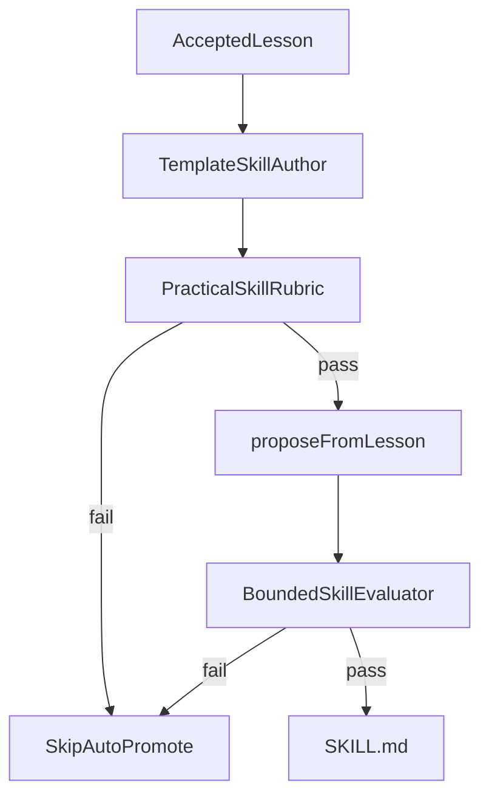

# 3. Practical Agent Skills for learned promotions

Date: 2026-09-01

## Status

Accepted

Amended by [1. Execution state lives in Mastra working memory](0004-execution-state-lives-in-mastra-working-memory.md)

## Context

Evolution previously re-serialized `lesson.statement` into skill `name`, `description`, and body. The L4 bounded evaluator only required non-empty markdown, so slogan-shaped `SKILL.md` files auto-promoted. That fails the [Agent Skills specification](https://agentskills.io/specification) that Mastra filesystem skills follow: `name` must be a directory-safe slug, `description` must say **what** and **when**, and the body must be imperative instructions an agent can execute after `load_skill`.

## Decision

Learned skills must be Agent Skills–compliant practical procedures.

- Default `SkillAuthor` is a deterministic template (no LLM). Description is statement (**what**) plus `Use when …` triggers. Body always includes `## When to Use`, `## Instructions`, `## Working Memory`, and `## Do Not`.
- `## Working Memory` names the sufficient statistic for the procedure (facts and slots to keep in Mastra thread-scoped schema working memory). It must not ask the agent to store tool transcripts. Execution-state ownership is recorded in [ADR-0004](0004-execution-state-lives-in-mastra-working-memory.md).
- `candidateArtifact.markdown` is the **body only**; `FilesystemSkillPublisher` composes frontmatter.
- `createBoundedSkillEvaluator` uses the same rubric (`thin-skill`, `missing-when-section`, `missing-working-memory-section`, `slogan-description`, …).
- LLM authoring, multi-lesson merge, and `references/` / `scripts/` bundles are out of scope (including no `state.schema.json`).

## Consequences

Slogan skills are not auto-promoted. Skills without a Working Memory section fail the rubric. The template is generic; a future LLM `SkillAuthor` can replace the template without changing the artifact contract or evaluator. Runtime merge of working-memory slots remains Mastra’s job.
