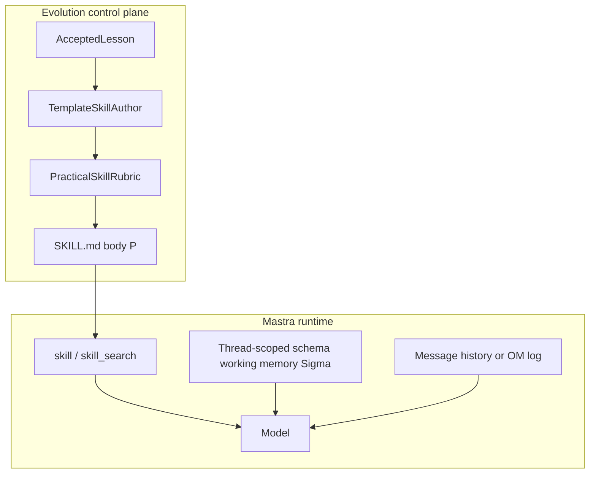

# 4. Execution state lives in Mastra working memory

Date: 2026-09-01

## Status

Accepted

Amends [3. Practical Agent Skills for learned promotions](0003-practical-agent-skills.md)

## Context

[SKILL.state](https://arxiv.org/abs/2608.26263) (Badhe, Tiwari, Chung, 2026) shows that long-horizon skill execution improves when the model sees `(P, Σt, Ot)` — immutable procedure text, a structured execution state, and the latest observation — and discards reasoning after a validated state patch. Cumulative tokens become `O(T)` instead of `O(T²)`.

Mastra Evolution is the **control plane** that authors and promotes Agent Skills (`P`). Mastra is the **runtime** that executes agents. [ADR-0001](0001-agent-first-workspace-attach.md) forbids wrapping `generate`/`stream`. Implementing a discard-history SKILL.state loop inside Evolution would violate that split.

Mastra already provides the closest production analog of `Σ ⊕ ΔΣ`:

- **Schema working memory** merges provided JSON fields, deletes keys set to `null`, and replaces arrays — the same dictionary-merge semantics as SKILL.state.
- **Thread scope** isolates per-run execution state. Resource scope is a user profile and would leak skill state across conversations.
- **Observational Memory** compresses conversational history (the paper’s Memory baseline). It is complementary for long horizons, not a substitute for named execution slots.

The [Agent Skills specification](https://agentskills.io/specification) has no execution-state field. Emitting `references/state.schema.json` from one lesson would invent a schema the paper itself treats as a failure mode (no fixed schema known in advance; domain schemas are authored once and reused).

## Decision

- Do **not** implement SKILL.state (or any discard-history skill runtime) in Evolution.
- Learned skills must name the sufficient statistic in `## Working Memory` (facts and slots, not tool transcripts). See the amended [ADR-0003](0003-practical-agent-skills.md).
- Apps that run long procedures attach **thread-scoped schema working memory**. Observational Memory remains optional for history growth.
- The domain schema is **app-owned** and reused across skills in that domain. Evolution does not infer JSON Schema from a single lesson and does not publish schema blobs under `references/`.

## Consequences

Evolution stays a control plane: it authors slot _hints_ in `SKILL.md`; the app-owned `Memory` schema is `Σ`. Mastra (or a future Agent Skills consumer) owns merge, persistence, and context management. Promoting slogan skills that omit Working Memory fails the practical-skill rubric. Small models that mishandle JSON patches remain a Mastra/runtime concern, not an Evolution packaging concern.
