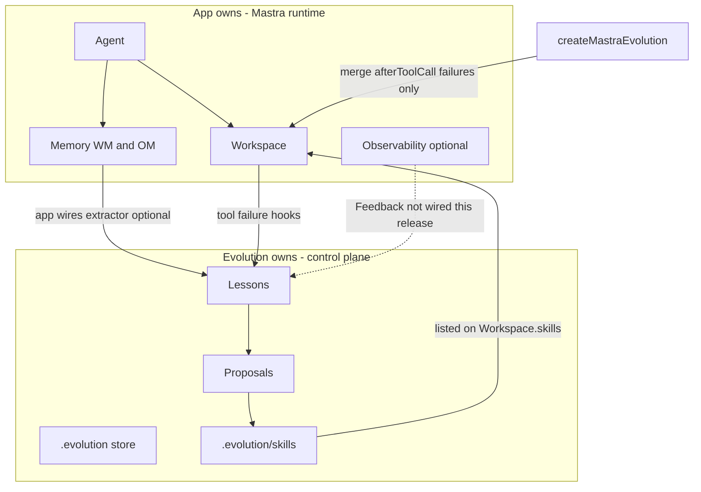

# 5. Evolution layer ownership on existing Mastra agents

Date: 2026-09-01

## Status

Accepted

Amends [1. Agent-first workspace attach](0001-agent-first-workspace-attach.md)

Related: [3. Practical Agent Skills for learned promotions](0003-practical-agent-skills.md), [4. Execution state lives in Mastra working memory](0004-execution-state-lives-in-mastra-working-memory.md)

## Context

Mastra developers attach Evolution to agents that already have `Workspace`, `Memory`, skills, and optionally observability. The attach API ([ADR-0001](0001-agent-first-workspace-attach.md)) is correct, but ownership was easy to misread: co-locating Mastra `memory.db` under `.evolution/`, an identity-only `register`, and dual ingress paths (hooks vs extractors) blurred the control-plane / runtime split.

Alternative topologies were considered:

- **Learning subagent** (`agents: { evolutionLearner }`): strong identity separation, but requires a supervisor redesign, parent Memory, and suffers [fresh-thread-per-delegation](https://mastra.ai/docs/subagents) isolation — weak as the sole durable lesson store.
- **Observability Feedback → skills**: [Feedback](https://mastra.ai/docs/observability/feedback) is ratings/comments/corrections on traces, not a lesson pipeline; needs exporters/storage and is a future optional ingress, not the skill author.

## Decision

Evolution is an **additive control plane** on an existing Mastra agent. Attach-in-place remains the default. Ownership:

| Surface                                   | Owner     | Evolution role                                                          |
| ----------------------------------------- | --------- | ----------------------------------------------------------------------- |
| `Agent`                                   | App       | Read id / probe capabilities only                                       |
| `Workspace`                               | App       | Merge `tools.hooks.afterToolCall` (failures only); list learned skills  |
| `Memory` (WM / OM)                        | App       | Never construct or set; `extractor()` is a fragment for the app to wire |
| Observability / Feedback                  | App       | Probe-only until a future adapter                                       |
| `.evolution/` store + lessons + proposals | Evolution | Hobby or Postgres store                                                 |
| `.evolution/skills`                       | Evolution | Publish promoted `SKILL.md`                                             |
| Curated `{basePath}/skills`               | App / git | Not overwritten by promote                                              |

**App constructs:** `Agent`, `Workspace`, optional `Memory`, optional Mastra observability.

**Evolution constructs:** Evolution store, learning/improvement runtimes, filesystem skill publisher under `.evolution/skills`.

**Evolution mutates:** workspace `tools.hooks.afterToolCall` only (compose via `getToolsConfig` / `setToolsConfig`; preserve `requireApproval` and other keys). Agent constructor `hooks` exist in Mastra ([using tools](https://mastra.ai/docs/agents/using-tools)) but attach stays workspace-based so Studio/A2A turns are covered.

**Evolution never:** sets `agent.memory`, wraps `generate`/`stream`, replaces Workspace, requires `agents:` supervisors, or treats observability Feedback as the skill author.

**Evidence ingress priority:**

1. Observational Memory extractors / explicit `onExtracted` (and HTTP `/evolution/extract`) — procedures and corrections
2. Workspace `afterToolCall` — **tool failures only**
3. (Future) Feedback → ingest adapter — not in this release

**Publish boundary:** curated skills under workspace `skills/`; learned skills under `.evolution/skills`. Do not store app Mastra Memory databases under `.evolution/`.

## Consequences

Docs and JSDoc must state this contract; examples must keep Mastra Memory persistence outside `.evolution/`. Learning-subagent presets and Feedback→lesson bridges remain future work and must not become the required path for existing single-agent apps. `register(agent)` stays an identity compatibility stub (`Object.is`); renaming it would be a breaking API change.
