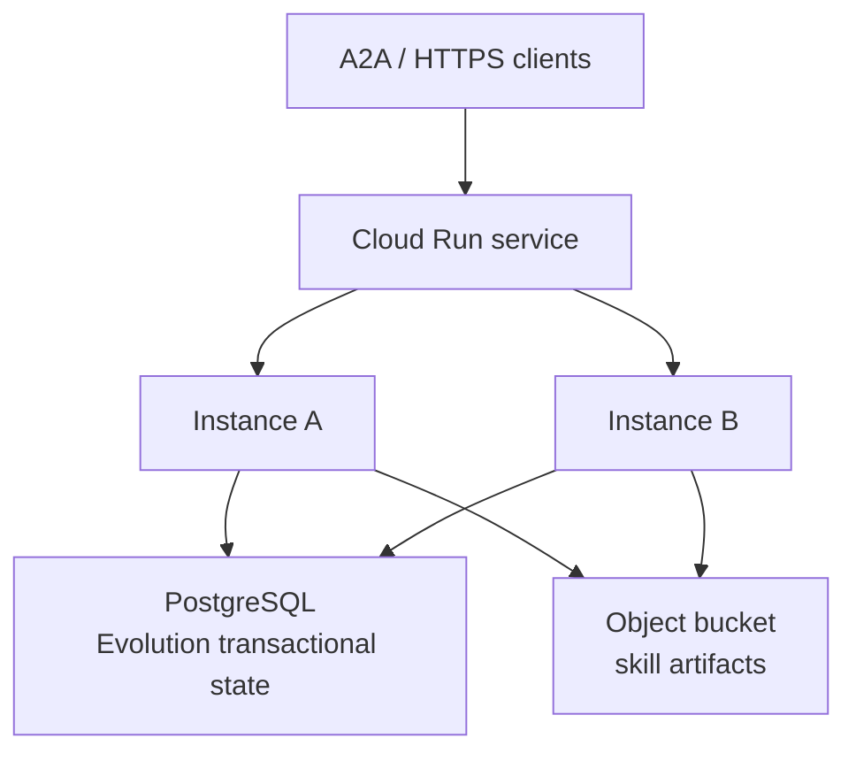

# Cloud Run deployment

Use this layout when more than one instance serves the same agent (A2A, HTTP, or otherwise). Product origin: [`RFC.md`](../../RFC.md) §26–§27. Example wiring: [`examples/cloud-run-a2a`](../../examples/cloud-run-a2a).

## PostgreSQL for state, object storage for artifacts

| Store         | Holds                                 | Adapter                              |
| ------------- | ------------------------------------- | ------------------------------------ |
| PostgreSQL    | Evidence, lessons, proposals, events  | `@mastra-evolution/storage-postgres` |
| Object bucket | Skill blobs, workspace files, exports | Mastra skill publisher / GCS         |

Hobby single-process use can stay on `@mastra-evolution/storage-local` (filesystem). That path is single-writer and is not a Cloud Run default.

## Warning: do not use Cloud Storage FUSE as a SQLite/LibSQL database

Cloud Run can mount a Cloud Storage bucket with FUSE. FUSE is **not** a local disk:

- no file locking for concurrent writes
- last-writer-wins replacements
- not fully POSIX compliant

**Do not** put SQLite, LibSQL, or any Evolution/Mastra transactional database on a GCS FUSE mount. A GCS mount is appropriate for immutable or versioned artifacts only.

Reference: [Cloud Storage volume mounts](https://docs.cloud.google.com/run/docs/configuring/services/cloud-storage-volume-mounts).

## Multi-instance optimistic concurrency

Two Cloud Run instances may try to publish the same skill. `@mastra-evolution/storage-postgres` applies optimistic concurrency on proposal `version` (and published status). One writer wins; the other receives `VersionConflictError` and must not clobber artifacts.

Operational rules:

- Every instance uses the same `DATABASE_URL`.
- Skill bytes go to versioned blob storage, not a shared FUSE SQLite file.
- Evolution is transport-agnostic: A2A supplies thread and resource ids; the store keys on those, not on instance identity.

See `RFC.md` F5 / KTD10 and `examples/cloud-run-a2a/README.md`.
