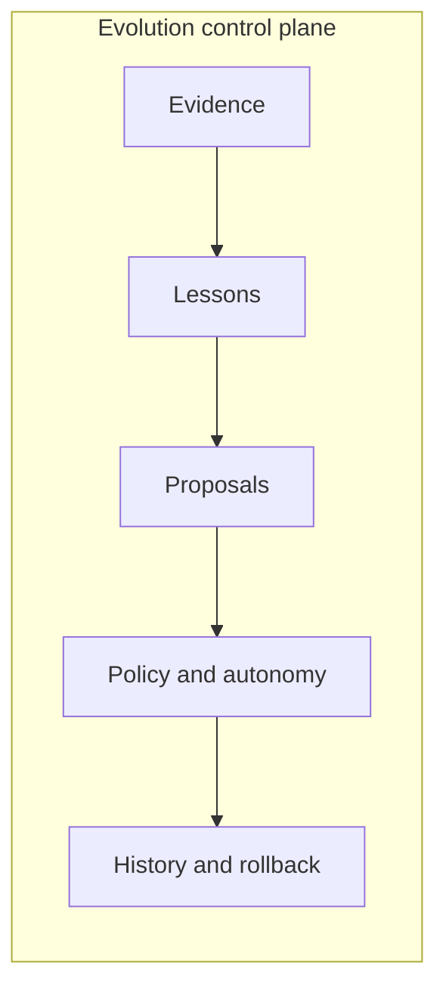
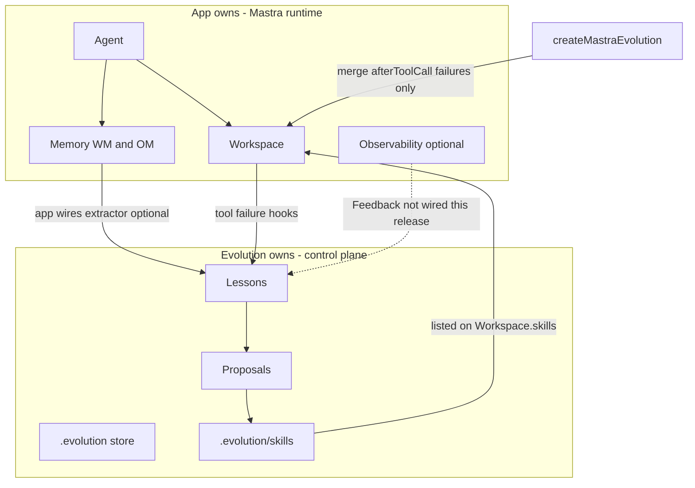
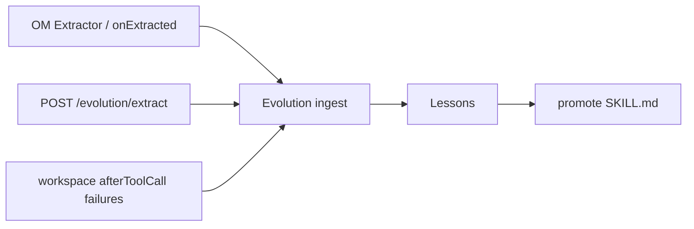
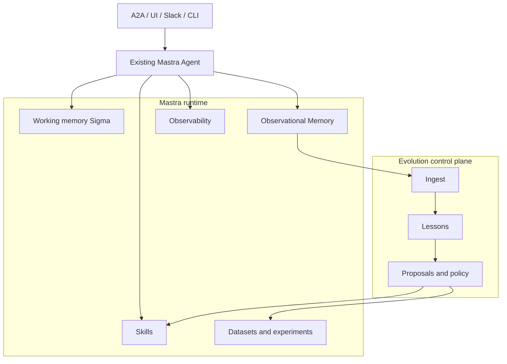

# Evolution control plane vs Mastra runtime

Mastra Evolution is the **control plane** for evidence-driven learning and improvement. Mastra remains the **runtime** that executes agents. This note records the split implementers should preserve. Normative ownership: [ADR-0005](../adr/0005-evolution-layer-ownership-on-existing-mastra-agents.md).

## Control plane (Evolution)

Evolution owns the durable loop:

1. Ingest evidence (corrections, tool **failures**, extractor signals; Feedback later).
2. Aggregate scoped **lessons** with provenance.
3. Draft **improvement proposals** (skills in the first release).
4. Evaluate candidates against policy.
5. Promote or reject, with rollback metadata.

Domain types and ports live in `@mastra-evolution/core`. Learning and improvement are independently enableable. Core does not import Mastra APIs.



What Evolution stores:

- Evidence and lesson records (scoped; no implicit global learning)
- Proposal lifecycle and evaluation verdicts
- Promotion policy decisions and autonomy level
- Provenance linking published skill revisions to evidence

What Evolution must not replace: agent execution, memory internals (including working-memory merge), skill format, datasets, experiments, A2A, authz, or observability backends. Learned skills may _name_ working-memory slots in `SKILL.md`; the app-owned Mastra `Memory` schema is the execution state `Σ` (see [ADR-0004](../adr/0004-execution-state-lives-in-mastra-working-memory.md)).

## Ownership table

| Surface                  | Owner     | Evolution role                                               |
| ------------------------ | --------- | ------------------------------------------------------------ |
| `Agent`                  | App       | Id + capability probe only                                   |
| `Workspace`              | App       | Merge `afterToolCall` (failures); list learned skills        |
| `Memory` (WM / OM)       | App       | Never construct; optional `extractor()` fragment for the app |
| Observability / Feedback | App       | Probe-only until a future adapter                            |
| `.evolution/` store      | Evolution | Evidence, lessons, proposals, events                         |
| `.evolution/skills`      | Evolution | Promoted `SKILL.md`                                          |
| Curated `skills/`        | App / git | Unchanged by promote                                         |



## Evidence ingress priority



1. Observational Memory extractors / explicit `onExtracted` (procedures, corrections)
2. Workspace `afterToolCall` — tool **failures** only
3. (Future) Observability Feedback → ingest — not shipped

Do **not** require a learning subagent (`agents:`) for existing single-agent apps. Subagent memory uses a [fresh thread per delegation](https://mastra.ai/docs/subagents); that topology is an advanced optional preset later, not the default attach.

## Runtime (Mastra)

Mastra owns execution and the primitives Evolution adapts to:

| Runtime surface                               | Role                                                                  |
| --------------------------------------------- | --------------------------------------------------------------------- |
| `Agent`                                       | Existing app-constructed agent. Attach without subclassing.           |
| Working memory (thread-scoped schema)         | Structured execution state `Σ` for procedures; merge / null-delete    |
| Observational Memory and extractors           | Primary learning ingress (`onExtracted`); history compression         |
| Skills / Skill Search / versioned skill blobs | Mutable production artifact (skills only in MVP)                      |
| Datasets, scorers, experiments                | Candidate evaluation                                                  |
| Tool hooks and processors                     | Fallback: ingest **tool failures** only (successes are not journaled) |
| Observability                                 | Traces; Feedback is review signals, not Evolution lessons             |
| Auth / FGA                                    | Identity and resource context Evolution consumes, never reimplements  |



Attach via `createMastraEvolution({ agent, workspace, learning: true })`. Pass `workspace` for a real Mastra Agent (no sync `agent.workspace` field). The factory merges workspace `tools.hooks` so Studio and A2A turns still surface **tool failures** without `applyToCall`. Successful tool results are not stored; procedures and corrections come from extractors / `onExtracted`. `register` returns the same instance (`Object.is`); there is no `SelfImprovingAgent`.

## Attach recipes

| Recipe         | App owns                                        | Evolution enables                | Notes                                                 |
| -------------- | ----------------------------------------------- | -------------------------------- | ----------------------------------------------------- |
| Learning-only  | Agent + Workspace                               | `learning: true`                 | Failures → lessons; no skill publish                  |
| + Improvement  | Same                                            | `improvement: { autonomy: ... }` | Promote under `.evolution/skills`                     |
| + Schema WM    | App `Memory` + LibSQL **outside** `.evolution/` | Unchanged                        | ADR-0004; Evolution authors WM section in skills only |
| + OM extractor | App wires `observation.extract`                 | `evolution.extractor()` fragment | Primary procedure ingress                             |
| Cloud Postgres | Explicit `store`                                | Same attach                      | See `examples/cloud-run-a2a` (no Memory required)     |

### Wire Observational Memory extractor (app-owned Memory)

Apps that construct `Memory` own the OM config ([OM docs](https://mastra.ai/docs/memory/observational-memory)). Evolution exposes a fragment; the app wires it (or calls `onExtracted` from HTTP `/evolution/extract`). Evolution does not auto-attach to `agent.memory`.

```ts
import { createMastraEvolution } from '@mastra-evolution/adapters';

const evolution = createMastraEvolution({ agent, workspace, learning: true });
const fragment = evolution.extractor();

// Explicit extract (demo HTTP path) — primary procedure ingress without OM:
await fragment.onExtracted({
  kind: 'procedure',
  summary: 'Use booked revenue excluding cancellations.',
  suggestedAction: 'create-skill',
});

// Or pass a Mastra Extractor / compatible object into
// memory.options.observationalMemory.observation.extract that invokes
// fragment.onExtracted when observations arrive. Persist Memory under an
// app path (e.g. `.mastra/`), never under `.evolution/`.
```

Prefer calling `fragment.onExtracted(signal)` from your extractor or HTTP path so learning stays explicit.

## Adapter boundary

`@mastra-evolution/adapters` is the only package that should know Mastra APIs. It probes capabilities and degrades (missing extractors fall back to hooks; missing experiments leave proposals unpublished or require an external evaluator). When Mastra gains a native primitive that overlaps Evolution, adapt to Mastra and deprecate the overlap. See also [`packages/adapters/README.md`](../../packages/adapters/README.md).
