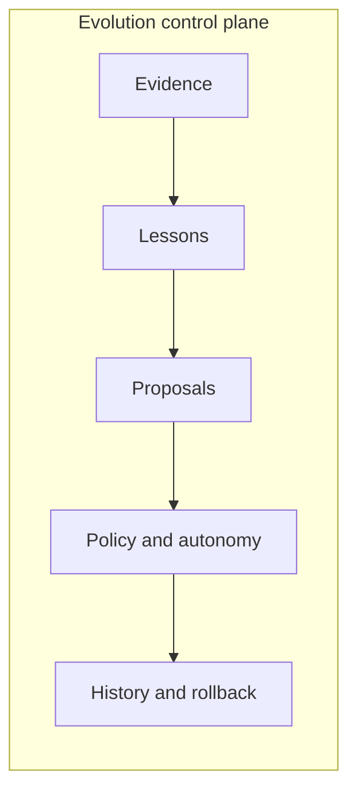
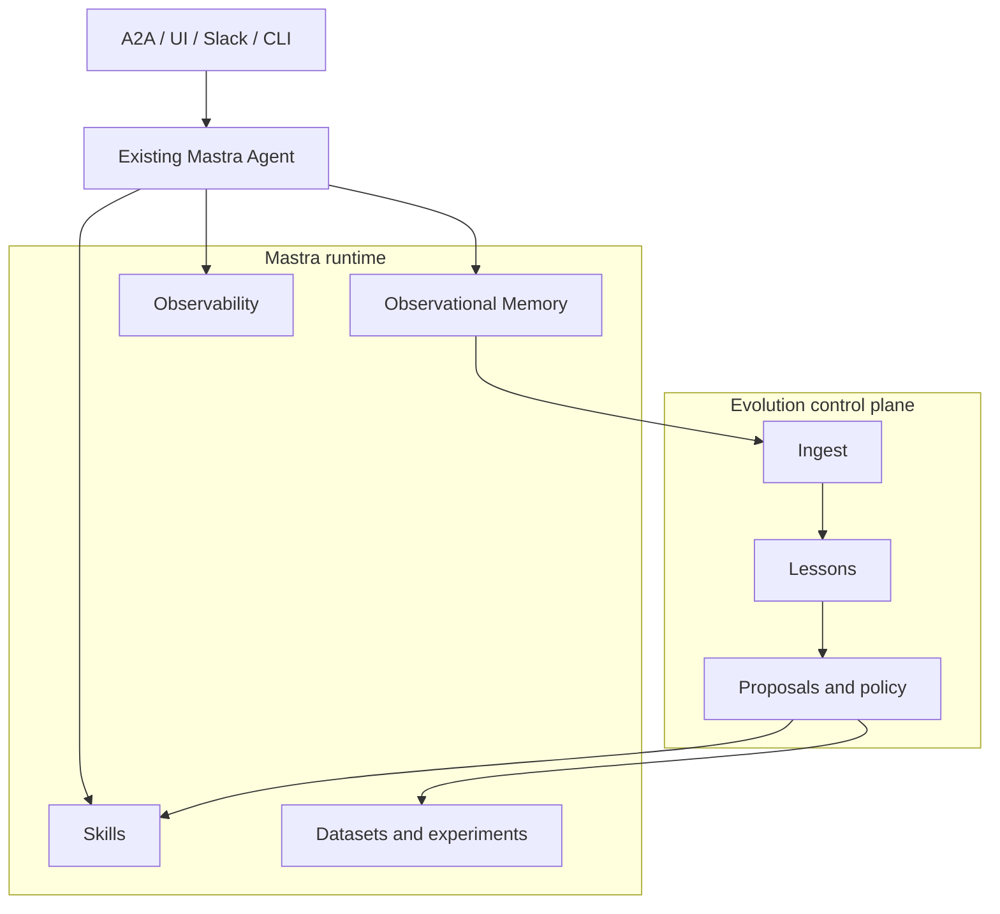

# Evolution control plane vs Mastra runtime

Mastra Evolution is the **control plane** for evidence-driven learning and improvement. Mastra remains the **runtime** that executes agents. Product behavior lives in [`RFC.md`](../../RFC.md); this note records the split implementers should preserve.

## Control plane (Evolution)

Evolution owns the durable loop:

1. Ingest evidence (corrections, tool outcomes, extractor signals, feedback).
2. Aggregate scoped **lessons** with provenance.
3. Draft **improvement proposals** (skills in the first release).
4. Evaluate candidates against policy.
5. Promote or reject, with rollback metadata.

Domain types and ports live in `@mastra-evolution/core`. Learning and improvement are independently enableable (`RFC.md` P2 / plan KD2). Core does not import Mastra APIs.

What Evolution stores:

- Evidence and lesson records (scoped; no implicit global learning)
- Proposal lifecycle and evaluation verdicts
- Promotion policy decisions and autonomy level
- Provenance linking published skill revisions to evidence

What Evolution must not replace: agent execution, memory internals, skill format, datasets, experiments, A2A, authz, or observability backends.

## Runtime (Mastra)

Mastra owns execution and the primitives Evolution adapts to:

| Runtime surface                               | Role                                                                 |
| --------------------------------------------- | -------------------------------------------------------------------- |
| `Agent`                                       | Existing app-constructed agent. Attach without subclassing.          |
| Observational Memory and extractors           | Primary learning ingress (`onExtracted`)                             |
| Skills / Skill Search / versioned skill blobs | Mutable production artifact (skills only in MVP)                     |
| Datasets, scorers, experiments                | Candidate evaluation                                                 |
| Tool hooks and processors                     | Fallback evidence when extractors are absent                         |
| Observability                                 | Traces Evolution complements with `evolution.*` events               |
| Auth / FGA                                    | Identity and resource context Evolution consumes, never reimplements |

Attach via `createMastraEvolution({ agent, learning: true })`. The factory infers `agent.workspace` and merges workspace `tools.hooks` so Studio and A2A turns still ingest without `applyToCall`. `register` returns the same instance (`Object.is`); there is no `SelfImprovingAgent`.

## Adapter boundary

`@mastra-evolution/mastra` is the only package that should know Mastra APIs. It probes capabilities and degrades (missing extractors fall back to hooks; missing experiments leave proposals unpublished or require an external evaluator). When Mastra gains a native primitive that overlaps Evolution, adapt to Mastra and deprecate the overlap (`RFC.md` Risk 6).
