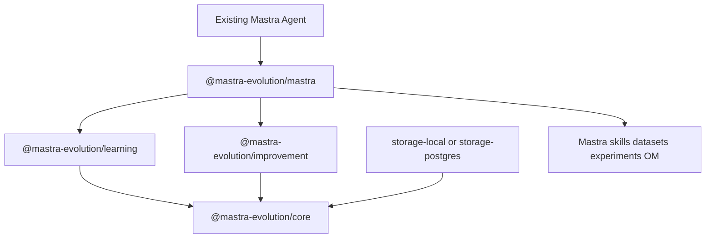
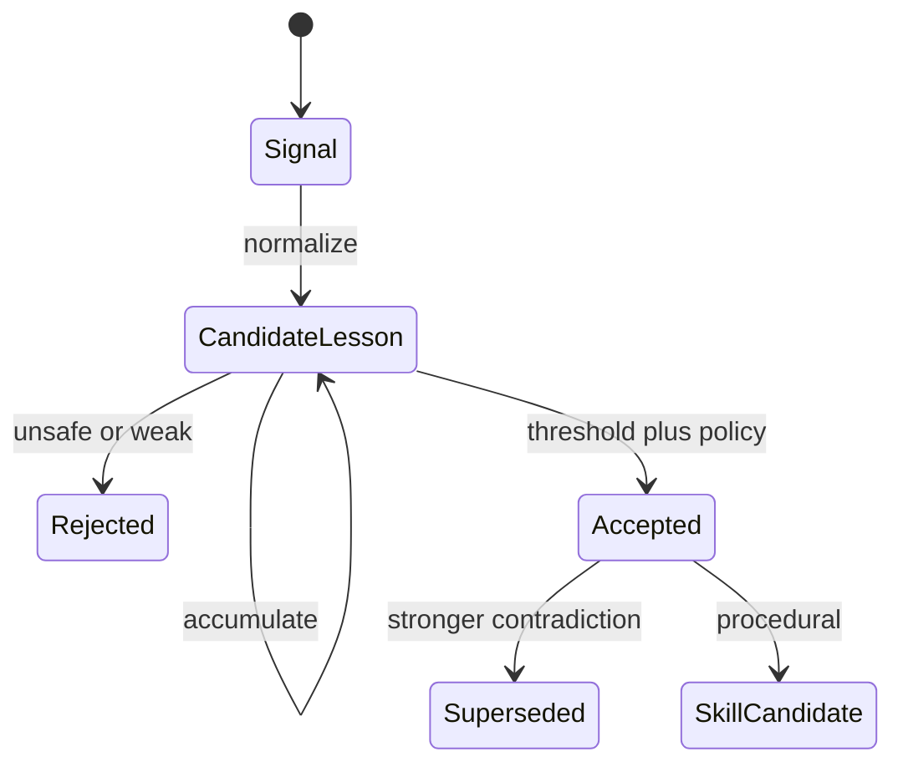
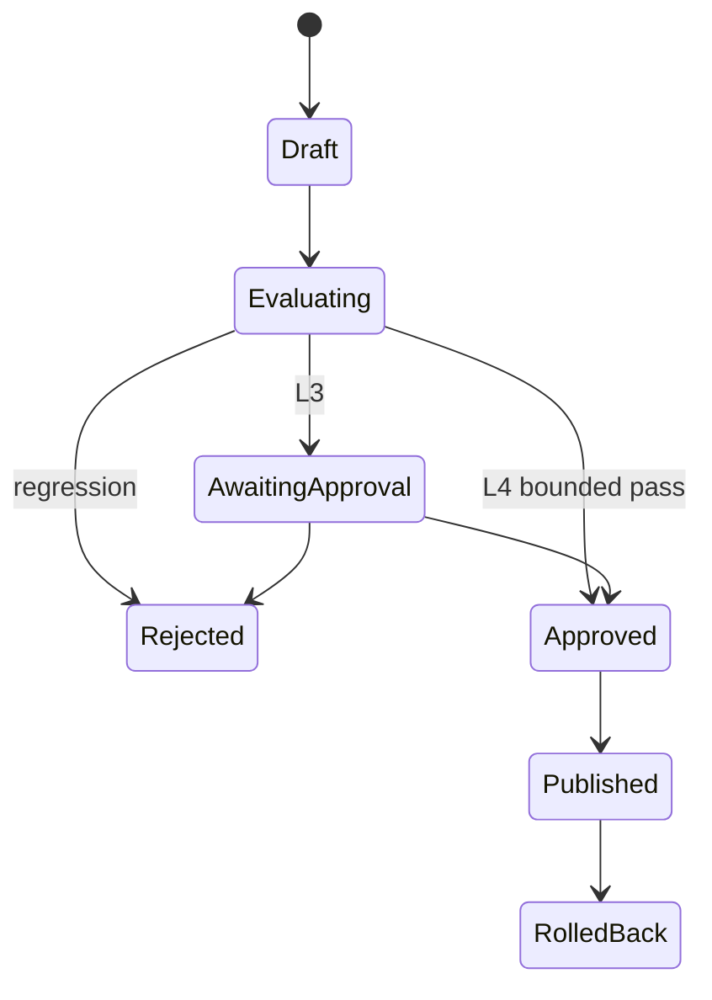

# Mastra Evolution - Plan

## Goal Capsule

- **Objective:** Ship `@mastra-evolution/*` so an existing Mastra agent can learn from production evidence and promote evaluated skill revisions without replacing Mastra's runtime.
- **Product authority:** `RFC.md` owns product behavior. This plan owns how. Official Mastra docs and `MASTRA_CAPABILITIES.md` own adapter surfaces. When Mastra gains a native primitive that overlaps Evolution, adapt to Mastra and deprecate the overlap (`RFC.md` Risk 6).
- **Open blockers:** None. RFC open questions Q1–Q7 are adopted as Key Decisions below.
- **Execution profile:** Domain logic is test-first with fakes from `@mastra-evolution/testing`. Mastra adapter work starts with a compatibility spike. Examples use install/runtime smoke, not unit coverage of scaffolding.
- **Stop conditions:** Stop if a Mastra API required for the vertical slice is gone and no adapter shim exists. Stop if skill publication cannot be discovered by Mastra skill search. Do not ship autonomous instruction, workflow, auth, or source-code mutation in the first release.
- **Tail ownership:** Implementers execute units in dependency order. Cleanup of spike-only code is part of Definition of Done.

Product Contract preservation: RFC meaning kept; Q1–Q7 recommendations adopted as KD1–KD7. No R-ID splits.

---

## Product Contract

### Summary

Mastra Evolution is a TypeScript library that attaches an evidence-driven evolution loop to existing Mastra agents. Mastra owns execution. Evolution owns ingest → lesson → proposal → evaluate → promote, with skills as the only automatically mutable artifact in the first release.

### Problem Frame

Mastra already provides memory, skills, datasets, experiments, processors, A2A, auth, storage, and observability. Developers still lack one product that turns real usage into scoped, provenance-backed, policy-gated agent improvement. Porting a Hermes-style runtime would duplicate Mastra and fight API churn.

### Key Decisions

- KD1. Evolution runtime plus Mastra adapter, not a Hermes port, Agent subclass, processor-only design, or required central service. (session-settled: user-directed — chosen over Alternatives A–D in `RFC.md` §39: Mastra alignment and upgrade isolation.) Governs R1, R15, R23.
- KD2. Self-learning and self-improvement are independently enableable. (session-settled: user-directed — chosen over a single selfImproving flag: learning must work without mutation.) Governs R2.
- KD3. Every durable lesson has an explicit scope. No implicit global learning. (session-settled: user-directed — chosen over implicit global memory writes: tenant safety.) Governs R6, R20.
- KD4. Skills are the only automatically mutable production artifact in the MVP. (session-settled: user-directed — chosen over instruction/workflow/code mutation first: inspectable evolution target.) Governs R8, R16.
- KD5. `Lesson` is public API. Ports stay framework-neutral. First implementation is Mastra-only. (session-settled: user-directed — RFC Q1/Q2.) Governs R5, R15.
- KD6. Production learning is asynchronous and must not fail the user response. Tests may run synchronously. (session-settled: user-directed — RFC Q3.) Governs R22.
- KD7. Mastra owns runtime skill artifacts. Evolution owns provenance and proposal metadata. (session-settled: user-directed — RFC Q4.) Governs R8, R17.
- KD8. Organization-wide learning is never automatic. (session-settled: user-directed — RFC Q5.) Governs R6, R20.
- KD9. Source-code modification is out of the first product. Future work would generate PRs. (session-settled: user-directed — RFC Q6.) Governs R16.
- KD10. Object storage is for artifacts only. Transactional state is a database, never Cloud Storage FUSE. (session-settled: user-directed — RFC Q7.) Governs R13, R14.

### Actors

- A1. Individual developer using one local process and a local database.
- A2. Application developer attaching Evolution to an existing Mastra agent used from A2A, UI, Slack, CLI, API, or workflows.
- A3. Enterprise platform team running multi-instance agents with tenant isolation, approval, audit, and rollback.
- A4. Existing Mastra agent (unchanged runtime type).
- A5. Human approver for L3 promotion.

### Requirements

**Attachment and packaging**

- R1. Developers attach Evolution to an existing Mastra `Agent` without subclassing or replacing the agent runtime.
- R2. Self-learning and self-improvement can be enabled independently.
- R3. The public install path is `@mastra-evolution/core` plus `@mastra-evolution/mastra`, with optional storage and preset packages.
- R4. Core domain types do not import Mastra runtime APIs.

**Learning**

- R5. Evolution persists `Evidence` and `Lesson` objects with provenance.
- R6. Every durable lesson carries an explicit `EvolutionScope` of thread, resource, team, agent, or organization.
- R7. Related observations aggregate into one lesson with confidence and occurrence count.
- R8. Accepted procedural lessons can produce a draft Mastra-compatible skill (`SKILL.md` / Agent Skills spec).
- R9. A single interaction does not become organization-level durable behavior.
- R10. Contradiction handling supersedes the weaker lesson rather than appending both facts to a prompt.
- R11. Policy and security instructions are non-learnable by default.
- R12. Evidence ingestion is idempotent on a deterministic source identity.

**Improvement and governance**

- R13. Improvement produces an `ImprovementProposal` rather than silently mutating production behavior.
- R14. Candidate skill changes are evaluated against a Mastra dataset and experiment before promotion.
- R15. Promotion uses composable policies and autonomy levels L0–L5. Default hobby skill improvement is L4 bounded. Default enterprise skill improvement is L3 (approval required).
- R16. The MVP must not automatically modify credentials, authz, secrets, deployment, network, or application source.
- R17. Every published improvement records previous revision, candidate revision, evidence, evaluation, publisher, timestamp, and policy decision, and can be rolled back.
- R18. Distributed workers must not publish conflicting skill revisions.

**Operations**

- R19. Local hobby use requires no PostgreSQL, Redis, queue, or Kubernetes.
- R20. Cross-scope promotion requires an explicit `ScopePromotionPolicy`.
- R21. Evolution consumes Mastra identity/resource context and does not invent a parallel authorization model.
- R22. Failure to learn records an error and retries independently. It does not fail the agent response by default.
- R23. The Mastra adapter detects capabilities at runtime and degrades: missing extractors fall back to a processor/hook path; missing experiments leave candidates as proposals or require an external evaluator.
- R24. Evolution emits structured telemetry (`evolution.ingest` through `evolution.rollback`) without replacing Mastra observability.

### Key Flows

- F1. Local learning-only attachment
  - **Trigger:** A1 installs packages and enables learning without improvement.
  - **Actors:** A1, A4
  - **Steps:** Create learning with autonomy learn. Attach via `createMastraEvolution`. Agent answers as today. Evidence persists. No skill is published.
  - **Covered by:** R1, R2, R19, R22
- F2. Evidence to accepted lesson
  - **Trigger:** User correction or extractor signal arrives.
  - **Actors:** A4
  - **Steps:** Normalize to `Evidence`. Deduplicate against similar candidates. Accumulate. Accept only after confidence and policy thresholds. Scope stays at the evidence's scope.
  - **Covered by:** R5, R6, R7, R9, R12
- F3. Procedural lesson to published skill
  - **Trigger:** An accepted procedural lesson exists and improvement is enabled for skills.
  - **Actors:** A4, A5 when L3
  - **Steps:** Draft `SKILL.md`. Static-validate. Add regression cases. Run baseline and candidate experiments. Policy publishes or requests approval. Skill becomes discoverable to the same agent. Later request can use it. History supports rollback.
  - **Covered by:** R8, R13, R14, R15, R17
- F4. Poisoning attempt
  - **Trigger:** Untrusted input asks for organization-wide behavior change or secret retention.
  - **Steps:** Persist evidence at source scope. Do not auto-promote scope. Reject policy/security lessons. Redact secrets. Do not change authorization.
  - **Covered by:** R9, R11, R16, R20, R21
- F5. Multi-instance publication
  - **Trigger:** Two Cloud Run instances attempt to publish the same skill.
  - **Actors:** A3
  - **Steps:** Transactional store applies optimistic concurrency. One publisher wins. The other records a conflict and does not clobber artifacts.
  - **Covered by:** R14, R18

### Acceptance Examples

- AE1. Existing agent, no subclass
  - **Covers:** R1, F1
  - **Given:** A Mastra `Agent` constructed by the app.
  - **When:** Evolution is attached through the adapter.
  - **Then:** The runtime type remains Mastra's `Agent`. No `SelfImprovingAgent` is required.
- AE2. One correction stays scoped
  - **Covers:** R6, R9, F2
  - **Given:** Alice corrects analytics terminology in her thread.
  - **When:** Learning runs.
  - **Then:** A resource- or thread-scoped candidate lesson exists. No organization skill is published.
- AE3. Repeated correction promotes a lesson
  - **Covers:** R7, F2
  - **Given:** The same correction appears from the same scope above the configured evidence threshold.
  - **When:** Aggregation runs.
  - **Then:** One accepted lesson exists with `occurrenceCount >= threshold` and linked `evidenceIds`.
- AE4. Learned skill is used later
  - **Covers:** R8, R14, F3
  - **Given:** A procedural lesson passed evaluation and policy.
  - **When:** A later request needs that procedure.
  - **Then:** Mastra skill search can load the published skill, and the agent follows it.
- AE5. Regression gate blocks a bad skill
  - **Covers:** R14, R15
  - **Given:** A candidate skill fails a production-derived dataset case or a critical scorer gate.
  - **When:** Promotion runs.
  - **Then:** Status is rejected. The previous skill revision remains active.
- AE6. Learner crash does not fail the user
  - **Covers:** R22, F1
  - **Given:** The store is unavailable after the model reply.
  - **When:** Ingestion throws.
  - **Then:** The user still receives the agent response. An evolution error event is recorded.
- AE7. Cross-tenant isolation
  - **Covers:** R6, R20, R21, F4
  - **Given:** Tenant A evidence exists.
  - **When:** Tenant B's agent runs.
  - **Then:** Tenant A lessons and skills are not visible to tenant B.

### Success Criteria

The first compelling release demonstrates `RFC.md` §45: existing agent → extractor/evidence → aggregated lesson → draft skill → dataset experiment → policy promote → skill discoverable → later use → provenance and rollback.

### Scope Boundaries

**In this plan**

- RFC phases 0–4: foundations, self-learning MVP, skill learning, evaluated self-improvement, enterprise governance (Postgres, approval, Cloud Run example).
- Autonomy metadata for L0–L5. Wiring for L4 bounded skill publish and L3 approval.

**Deferred for later** (`RFC.md` §20 v0.2–v0.5)

- Few-shot / prompt-fragment evolution.
- Agent instruction evolution.
- Dynamic workflow evolution.
- Tool-selection policy evolution.

**Outside this product's identity**

- Replacement Mastra `Agent`, A2A server, MCP runtime, memory subsystem, Observational Memory, skill format, vector database, auth framework, observability, datasets/scorers/experiments, workspace/sandbox.
- Direct production source-code mutation.
- Treating arbitrary user statements as globally trusted knowledge.

### Dependencies / Assumptions

- A1's Mastra app already constructs an `Agent` and can add processors, memory extractors, and a workspace.
- Observational Memory requires a supported Mastra storage adapter (`MASTRA_CAPABILITIES.md`).
- Supported `@mastra/core` / `@mastra/memory` range is pinned in U4 after a spike. Verification observed `@mastra/core@1.63.2`.
- Default evidence threshold for lesson acceptance is 3 corroborating events unless a preset overrides it.
- Default skill gate is: candidate correctness >= baseline, no critical regression, targeted failure cases improve, cost delta within config (`RFC.md` §32).
- Observational Memory extractors run on observe/reflect cycles, not every user turn. Tool hooks and feedback cover per-turn gaps (`MASTRA_CAPABILITIES.md`).

### Outstanding Questions

**Deferred to implementation**

- Exact minimum and maximum supported Mastra versions (U4 spike writes them into `MASTRA_CAPABILITIES.md` and peerDependencies).
- Exact `SKILL.md` frontmatter keys for provenance (must remain valid Agent Skills metadata).
- Numeric defaults for autonomy thresholds per preset, beyond the RFC level table.

### Sources / Research

- Origin: `RFC.md`
- Verification: `MASTRA_CAPABILITIES.md`
- Observational Memory docs: https://mastra.ai/docs/memory/observational-memory
- Extractors: https://mastra.ai/blog/introducing-memory-extractors
- Skills: https://mastra.ai/docs/skills
- Skill search: https://mastra.ai/reference/processors/skill-search-processor
- Datasets: https://mastra.ai/docs/datasets/overview
- Experiments / memory evals: https://mastra.ai/docs/evals/evals-with-memory
- Tool hooks: https://mastra.ai/docs/agents/tools
- FGA: https://mastra.ai/docs/auth/fga
- Cloud Storage FUSE: https://docs.cloud.google.com/run/docs/configuring/services/cloud-storage-volume-mounts
- Repo today: placeholder `packages/common` (`greet`) and root `typescript-template`. Keep pnpm 11, Trunk, Vitest, ESLint from `AGENTS.md`.

---

## Planning Contract

### Product Contract preservation

Product Contract unchanged in meaning. RFC Q1–Q7 mapped to KD5–KD10.

### Key Technical Decisions

- KTD1. Package map follows `RFC.md` §11: `core`, `learning`, `improvement`, `mastra`, `presets`, `storage-local`, `storage-postgres`, `testing`. Retire `@typescript-template/common` after the new packages compile. Governs R3, R4.
- KTD2. Attach without subclassing. Prefer composing extractors, `inputProcessors`, `outputProcessors`, and `hooks` at Agent construction when the app owns the factory. For an already-built Agent, pass call-time `hooks` and processor arrays on `generate`/`stream`. Per-call processor arrays replace the Agent defaults; per-call hooks merge by key. Cites KD1. Governs R1.
- KTD3. Primary learning ingress is `Extractor.onExtracted` on Observational Memory. Secondary ingress is agent `hooks.afterToolCall` and observability feedback. Extractors fire on observe/reflect cycles, not every turn; presets may lower OM `messageTokens` / enable `bufferOnIdle` for denser signals. Governs R5, R23.
- KTD4. Hobby path writes Agent Skills `SKILL.md` under the workspace filesystem and sets `SkillSearchProcessor` `blockingRefresh: true` so the new skill is searchable in the same turn. Enterprise publish uses Mastra stored-skills draft-to-publish / blob versions (`CompositeVersionedSkillSource`), not a filesystem overwrite. Writing a local file is not a versioned publish. Loaded skill instructions may stay in thread state until reload or TTL. Cites KD7. Governs R8.
- KTD5. Baseline vs candidate is two `startExperiment` runs on one pinned dataset version, then `compareExperiments()`. Memory-enabled agents use an inline experiment `task` that passes `{ threadId, resourceId }` and pre-creates threads. Candidate skill sets are Agent/workspace configuration, not an experiment option. Programmatic regression cases use `dataset.addItem()`; there is no documented trace-id-to-item API. Governs R14.
- KTD6. `storage-local` uses a local LibSQL/filesystem Evolution store for single-writer hobby use. `storage-postgres` is the multi-instance transactional store. Artifact bytes go to Mastra skill blobs or object storage, never a FUSE SQLite file. Cites KD10. Governs R19, R18.
- KTD7. Capability probing lives only in `@mastra-evolution/mastra`. Core talks ports. Missing optional capabilities degrade per R23 rather than crashing attach. Governs R23.
- KTD8. Domain tests use `@mastra-evolution/testing` fakes (in-memory store, recording publisher, scripted evaluator). Do not mock Mastra internals in unit tests. Adapter tests may use a pinned Mastra version in CI.
- KTD9. Learning work is enqueued after the agent response (async by default). A `sync: true` flag exists for tests. Cites KD6. Governs R22.
- KTD10. Optimistic concurrency on skill `baselineRevision` in the Evolution store serializes publication. Governs R18.

### High-Level Technical Design

Package edges:

Learning lifecycle (product behavior per F2; ports only):

Improvement lifecycle (per F3):

Ingestion must not sit on the user-response critical path (R22, KTD9).

### Assumptions

- Peer dependency style: `@mastra/core` and `@mastra/memory` are peerDependencies of `@mastra-evolution/mastra` only.
- Root package name becomes `mastra-evolution`. License stays Apache-2.0 unless the owner changes it.
- Changesets are added in U14 with CI. Exact Changesets vs existing `publish.yml` is an implementation detail inside that unit.
- Hobby preset uses learning L1 and skill improvement L4. Enterprise preset uses learning L1 and skill improvement L3 (`RFC.md` §19).

### Sequencing

Phase 0: U1–U3. Phase 1: U4–U5. Phase 2: U6. Phase 3: U7–U9. Phase 4: U10–U12. Phase 5 targets stay in Deferred to Follow-Up Work.

---

## Implementation Units

| U-ID | Title                          | Files touched                                              | Depends-on |
| ---- | ------------------------------ | ---------------------------------------------------------- | ---------- |
| U1   | Monorepo and core contracts    | `package.json`, `packages/*`, `pnpm-workspace.yaml`        | —          |
| U2   | Testing harness                | `packages/testing`                                         | U1         |
| U3   | Local Evolution store          | `packages/storage-local`                                   | U1, U2     |
| U4   | Mastra adapter skeleton        | `packages/mastra`, `MASTRA_CAPABILITIES.md`                | U1, U2     |
| U5   | Evidence ingestion and lessons | `packages/learning`                                        | U2, U3, U4 |
| U6   | Skill draft and publish        | `packages/learning`, `packages/mastra`                     | U5         |
| U7   | Datasets and experiments       | `packages/improvement`, `packages/mastra`                  | U5, U6     |
| U8   | Promotion, autonomy, rollback  | `packages/improvement`, `packages/core`                    | U7         |
| U9   | Presets and public factories   | `packages/presets`, `packages/mastra`                      | U5, U8     |
| U10  | Postgres and concurrency       | `packages/storage-postgres`                                | U3, U8     |
| U11  | Approval and enterprise policy | `packages/improvement`, `packages/presets`                 | U8, U10    |
| U12  | Examples, CI, docs             | `examples/*`, `.github/workflows/*`, `docs/architecture/*` | U9, U11    |

### U1. Monorepo and core contracts

- **Goal:** Replace the template placeholder with the RFC package skeleton and framework-neutral domain types plus ports.
- **Requirements:** R3, R4, R5, R6
- **Dependencies:** none
- **Files:** `package.json`, `pnpm-workspace.yaml`, `knip.json`, `packages/core/package.json`, `packages/core/src/**`, `packages/core/src/*.test.ts`; delete or stop exporting `packages/common`
- **Approach:**
  1. Rename the root package to `mastra-evolution` and add workspace packages listed in KTD1 as stubs except `core`.
  2. Put `Evidence`, `Lesson`, `ImprovementProposal`, `EvolutionScope`, `EvolutionEvent`, `AutonomyLevel`, and ports (`EvolutionStore`, `ImprovementEvaluator`, `EvolutionPublisher`, `ApprovalProvider`) in `packages/core`.
  3. Follow type shapes in `RFC.md` §12 and §24. Keep them in core, not copied into this plan.
  4. Core must not depend on `@mastra/*`.
- **Execution note:** Implement domain types test-first.
- **Patterns to follow:** Existing `packages/common` tsc `declaration` layout, Vitest project per package, kebab-case filenames.
- **Test scenarios:**
  - Creating a lesson without `scope` is a type/compile error (scope required on the type).
  - A value with `scope.type: "resource"` is accepted by `putLesson` port typings.
  - `packages/core` package.json has no `@mastra` dependency.
- **Verification:** `pnpm --filter @mastra-evolution/core test` and `pnpm --filter @mastra-evolution/core build` succeed. Knip sees the new workspace entries.

### U2. Testing harness

- **Goal:** Provide fakes so later units test policy and state machines without I/O.
- **Requirements:** R5, R12, R15
- **Dependencies:** U1
- **Files:** `packages/testing/src/**`, `packages/testing/src/*.test.ts`
- **Approach:** In-memory `EvolutionStore`, recording `EvolutionPublisher`, scripted `ImprovementEvaluator`, immediate `ApprovalProvider`, evidence builders, and a scenario runner that feeds ordered signals.
- **Execution note:** Implement new domain behavior test-first.
- **Patterns to follow:** Nullable/fake pattern from the testing package itself. No `vi.mock` of production modules.
- **Test scenarios:**
  - Putting the same evidence id twice in the in-memory store leaves one row (idempotency).
  - Scripted evaluator can return pass then fail across two calls.
  - Recording publisher captures publish payloads in order.
- **Verification:** `pnpm --filter @mastra-evolution/testing test`

### U3. Local Evolution store

- **Goal:** Single-writer local persistence for hobby and tests.
- **Requirements:** R5, R12, R19
- **Dependencies:** U1, U2
- **Files:** `packages/storage-local/src/**`, `packages/storage-local/src/*.test.ts`, contract tests under `packages/testing` or `packages/storage-local`
- **Approach:** Implement `EvolutionStore` on local LibSQL or filesystem as allowed by `RFC.md` §11.6. Run the shared contract suite from U2 against this adapter and the in-memory fake.
- **Test scenarios:**
  - Covers AE2 persistence: put evidence, find by agentId and scope, get the same summary.
  - Restart: open a second store on the same file and read the lesson.
  - Contract: every `EvolutionStore` method in `RFC.md` §24.1 is covered by the shared suite.
- **Verification:** Local store contract tests pass without network.

### U4. Mastra adapter skeleton and capability probe

- **Goal:** Isolate Mastra APIs and record the supported version range.
- **Requirements:** R1, R23
- **Dependencies:** U1, U2
- **Files:** `packages/mastra/src/**`, `packages/mastra/src/*.test.ts`, `MASTRA_CAPABILITIES.md`
- **Approach:**
  1. Spike Observational Memory `Extractor`, `SkillSearchProcessor`, datasets/experiments, agent `hooks`, and workspace skill publication against the current `@mastra/*` pair.
  2. Implement `MastraCapabilities` from `RFC.md` §25 via feature detection (duck-typing exports / runtime probes), not hardcoded version strings in domain code.
  3. `createMastraEvolution` returns `{ extractors, processors, hooks, applyToCall(options) }` without subclassing `Agent`. `register` may only mutate Agent construction inputs the caller still owns. Do not assume a post-construction additive processor setter exists.
  4. Write peerDependency range into `packages/mastra/package.json` and update `MASTRA_CAPABILITIES.md`.
- **Execution note:** Spike first. Delete spike-only files before the unit is done.
- **Patterns to follow:** Official attach style in https://mastra.ai/docs/agents/processors and https://mastra.ai/blog/introducing-memory-extractors
- **Test scenarios:**
  - Covers AE1: `register` does not replace the agent constructor.
  - When extractors are missing, capabilities.memoryExtractors is false and attach still succeeds.
  - When experiments are missing, capabilities.experiments is false and a proposal cannot auto-publish without an external evaluator (R23).
- **Verification:** Adapter package typechecks against the pinned Mastra versions. `MASTRA_CAPABILITIES.md` lists min/latest tested.

### U5. Evidence ingestion and lesson engine

- **Goal:** Close USE → OBSERVE → LEARN without publishing skills.
- **Requirements:** R5, R6, R7, R9, R10, R11, R12, R20, R22
- **Dependencies:** U2, U3, U4
- **Files:** `packages/learning/src/**`, `packages/learning/src/*.test.ts`, `packages/mastra/src/**` extractor mapping
- **Approach:**
  1. Map extractor output through `learningSignalSchema` (`RFC.md` §13). Treat suggested scope/action as advisory.
  2. Normalize to `Evidence`. Idempotent upsert. Redact via a pluggable redactor port before persist.
  3. Mine/aggregate lessons. Default accept threshold is 3 events (assumption). Never auto-promote scope (R9, R20).
  4. Contradiction: mark superseded; do not keep both as active facts (R10).
  5. Drop policy/security kinds by default (R11).
  6. Run the pipeline after the agent turn unless `sync: true`.
- **Execution note:** Implement lesson aggregation test-first with fakes.
- **Test scenarios:**
  - Covers AE2: one correction → candidate lesson at resource/thread scope, not organization.
  - Covers AE3: three matching corrections → one accepted lesson, `occurrenceCount` 3.
  - Covers AE6: store failure after a stubbed agent reply does not throw to the caller.
  - Duplicate source identity does not create a second evidence row.
  - Contradictory stronger lesson supersedes the earlier accepted lesson.
  - A signal classified as policy/security stays rejected.
  - Cross-scope query does not return another tenant's lessons (AE7).
- **Verification:** Learning package tests green. Example in U12 is not required yet; a unit-level scenario harness run is enough.

### U6. Skill draft and Mastra publish path

- **Goal:** Turn accepted procedural lessons into draft/published Mastra skills without evaluation gates yet (static validation only). Improvement package still disabled by default.
- **Requirements:** R8, R17
- **Dependencies:** U5
- **Files:** `packages/learning/src/**`, `packages/mastra/src/**` skill publisher, `packages/mastra/src/*.test.ts`
- **Approach:** Generate Agent Skills compatible `SKILL.md`. Static-validate name/description/instructions (`createSkill` rules). Hobby path writes under the workspace skills directory and refreshes search with `blockingRefresh: true`. Versioned publish (U8/U11) uses stored-skills draft-to-publish, not that file write. Do not auto-publish until U8 unless a test preset forces L4 with a stub evaluator.
- **Patterns to follow:** https://mastra.ai/docs/skills and `CompositeVersionedSkillSource` docs.
- **Test scenarios:**
  - Procedural accepted lesson produces a draft skill artifact that parses as SKILL.md with required frontmatter.
  - Non-procedural fact lesson does not create a skill.
  - Invalid skill name fails static validation and stays draft/rejected.
  - Publisher exposes distinct `writeDraft` vs `publishVersion` operations; a local `SKILL.md` write does not create a stored skill version.
- **Verification:** Skill publisher tests pass. No organization publish in default learning-only config.

### U7. Production cases as datasets and candidate evaluation

- **Goal:** Convert failures/corrections into Mastra dataset items and compare baseline vs candidate.
- **Requirements:** R13, R14
- **Dependencies:** U5, U6
- **Files:** `packages/improvement/src/**`, `packages/mastra/src/**` eval adapter, `packages/improvement/src/*.test.ts`
- **Approach:**
  1. From accepted failure/correction lessons, add dataset items through Mastra datasets (version bump is Mastra's).
  2. Build an `ImprovementProposal` targeting `{ type: "skill" }`.
  3. Evaluator port: two `startExperiment` / `runEvals` runs, then `compareExperiments()`. Inline `task` supplies memory ids. Candidate skills are applied by configuring the candidate Agent/workspace (KTD5).
  4. Record scores, regressions, verdict pass/fail/inconclusive on the proposal.
- **Test scenarios:**
  - Covers AE5: scripted evaluator fail → proposal status rejected, publisher not called.
  - Evaluator pass with improved targeted case and no critical regression → verdict pass.
  - Missing experiments capability → proposal stays draft/evaluating with an actionable error, no publish.
- **Verification:** Improvement unit tests use fakes. One adapter test documents the inline-task requirement.

### U8. Promotion policy, autonomy, rollback

- **Goal:** Policy-gated publish and rollback metadata.
- **Requirements:** R15, R16, R17, R18, R24
- **Dependencies:** U7
- **Files:** `packages/core/src/**` policy types, `packages/improvement/src/**`, tests
- **Approach:** Implement `PromotionPolicy.decide` (`RFC.md` §33). Compose EvidenceThreshold, Scope, Regression, Security, Approval. Honor L0–L5. L4 may publish skills only. Never publish authz/tool-permission targets. On publish, append evolution events and store rollback pointers. Optimistic concurrency on `baselineRevision` (KTD10). Emit `evolution.promote` / `evolution.rollback` spans or structured events; ingest/lesson/evaluate spans land in U5/U7.
- **Test scenarios:**
  - Hobby L4 + pass verdict → publish called once; event `evolution.promote` appended.
  - Enterprise L3 + pass verdict → status awaiting-approval, publisher not called.
  - Security target or credentials lesson → reject.
  - Two concurrent publishes with the same baseline: one succeeds, one conflicts (fake store version check is enough here; Postgres proves it in U10).
  - Rollback restores previous revision id on the publisher.
- **Verification:** Policy tests cover L1/L3/L4 and AE5.

### U9. Presets and public factories

- **Goal:** Batteries-included configs from `RFC.md` §38.
- **Requirements:** R2, R3, R15, R19
- **Dependencies:** U5, U8
- **Files:** `packages/presets/src/**`, `packages/mastra/src/**` factories, tests
- **Approach:** `localLearningPreset`, `localEvolutionPreset`, `cloudRunPreset`, `enterpriseGovernedPreset`. Factories `createLearning`, `createImprovement`, `createMastraEvolution`. Improvement omitted when disabled.
- **Test scenarios:**
  - Learning-only preset never constructs a publisher.
  - Local evolution preset uses storage-local, not postgres.
  - Enterprise preset default skill autonomy is validate/L3.
- **Verification:** Preset tests plus type exports on the mastra package.

### U10. PostgreSQL adapter and distributed concurrency

- **Goal:** Multi-instance transactional Evolution state.
- **Requirements:** R14, R18, R19
- **Dependencies:** U3, U8
- **Files:** `packages/storage-postgres/src/**`, contract tests
- **Approach:** Same contract suite as U3. Add unique/idempotent evidence keys and version column for proposals/skills. Do not implement GCS-as-database.
- **Test scenarios:**
  - Shared contract suite passes.
  - Two overlapping publishes: second sees version conflict.
  - Evidence idempotency under concurrent identical source ids (if the test harness can open two connections).
- **Verification:** Contract tests against a local Postgres when available; otherwise document a testcontainer or skip-if-unconfigured gate that CI enables.

### U11. Approval provider and enterprise policy chain

- **Goal:** Human approval as a promotion concern, not a learning concern.
- **Requirements:** R15, R20, R21
- **Dependencies:** U8, U10
- **Files:** `packages/improvement/src/**`, `packages/presets/src/**`, tests
- **Approach:** `ApprovalProvider` with callback/manual API first. CLI/webhook can be thin adapters. ScopePromotionPolicy requires independent users before organization scope. Authz context is passed through, never reimplemented.
- **Test scenarios:**
  - L3 pass → awaiting-approval until provider returns approved, then publish.
  - Provider reject → rejected, no publish.
  - Two users' corroboration can satisfy scope promotion policy; one user cannot.
- **Verification:** Approval tests green without a real webhook.

### U12. Examples, compatibility CI, architecture docs

- **Goal:** Runnable examples and CI that protect Mastra compatibility.
- **Requirements:** R1, R19, RFC §41–§45
- **Dependencies:** U9, U11
- **Files:** `examples/local-learning/**`, `examples/local-self-improvement/**`, `examples/cloud-run-a2a/**`, `.github/workflows/*`, `docs/architecture/**`, `README.md`
- **Approach:** Local learning example: existing Agent + OM extractor + Evolution learning only. Local self-improvement example: skill loop with a stub/small model eval. Cloud Run example: diagram + env for Postgres + artifact bucket, warning not to use FUSE for SQLite. CI: lint, typecheck, unit tests, package build, example compile, Mastra min and latest compatibility jobs. README replaces template placeholders.
- **Test expectation:** none for markdown/docs. Example compilation is the gate. Optional smoke script if a model key is absent should no-op with a skip.
- **Verification:** `pnpm lint && pnpm test && pnpm build` on the workspace. Example packages typecheck.

---

## Verification Contract

| Gate                 | Command                                                            | Applies            |
| -------------------- | ------------------------------------------------------------------ | ------------------ |
| Unit/integration     | `pnpm test`                                                        | All feature units  |
| Types/build          | `pnpm build`                                                       | After U1           |
| Lint                 | `pnpm lint:eslint` and `pnpm lint`                                 | Before merge       |
| Unused surface       | `pnpm knip`                                                        | After package adds |
| Coverage floors      | existing Vitest thresholds in `vitest.config.ts`                   | Domain packages    |
| Mastra compatibility | CI matrix min + latest supported `@mastra/core` / `@mastra/memory` | U4 onward          |
| Example compile      | workspace script or `pnpm --filter './examples/**' build`          | U12                |
| Vertical slice       | AE1–AE7 via unit/scenario tests; U12 example for the happy path    | Release            |

Do not require a live paid model in default `pnpm test`. Adapter tests that need Mastra packages use the pinned versions in the workspace.

---

## Definition of Done

- Every R1–R24 is traced to at least one unit.
- AE1–AE7 have tests or an example demonstration noted above.
- `@mastra-evolution/core` has no `@mastra/*` dependency.
- Learning-only attach cannot publish skills.
- Skill publication is Mastra-discoverable (search or listSkills in tests).
- Rollback metadata exists for published revisions.
- `MASTRA_CAPABILITIES.md` lists the pinned Mastra range.
- Spike-only and abandoned adapter experiments are deleted.
- `RFC.md` remains the product origin; this plan is the how.

**Per-unit:** the unit's Verification line is true and its test file exists for every feature-bearing unit (U1–U11). U12 uses compile/smoke.

---

## System-Wide Impact

- Replaces template identity (`typescript-template` / `packages/common`) with a multi-package library.
- Adds peer dependency on Mastra for the adapter package only.
- CI grows a compatibility matrix. Hobby users are unaffected if they do not install postgres/presets.
- Authorization remains Mastra's. Evolution must thread `requestContext` / resource ids on every store write. Production FGA is Mastra Enterprise Edition; OSS/hobby presets must not require it.
- Observability: additional spans. Do not disable Mastra tracing.

---

## Risks & Dependencies

| Risk                                    | Mitigation                                                                      |
| --------------------------------------- | ------------------------------------------------------------------------------- |
| Mastra API churn                        | Adapter boundary, capability probes, compatibility CI, `MASTRA_CAPABILITIES.md` |
| Extractors fire too rarely for learning | Document OM cycle behavior; fallback hooks/feedback; preset OM thresholds       |
| Experiments do not forward memory       | Inline task + pre-created threads (KTD5)                                        |
| Learning poisons skills                 | Scope, thresholds, non-learnable security, eval gates, rollback                 |
| Hobby UX becomes enterprise-heavy       | Local preset, no required queue/vector DB                                       |
| GCS FUSE used as a database             | KTD6; Cloud Run example warns                                                   |
| Duplicate Mastra features later         | RFC Risk 6 rule in Goal Capsule authority                                       |

---

## Alternative Approaches Considered

Recorded in `RFC.md` §39–§40. Planning does not reopen product-shape alternatives. Implementation alternative rejected: putting all Evolution state in Mastra memory metadata. That would couple lesson lifecycle to OM thread metadata and fail multi-instance proposal coordination.

---

## Phased Delivery

Matches `RFC.md` §44: U1–U3 foundations, U4–U5 learning MVP, U6 skill learning, U7–U9 evaluated improvement, U10–U12 enterprise + examples. Deferred v0.2–v0.5 targets stay out of these units.

---

## Documentation / Operational Notes

- Keep `RFC.md` and `MASTRA_CAPABILITIES.md` at repo root.
- U12 writes `docs/architecture/` for the control-plane vs runtime split.
- Examples are the onboarding path. Do not require a hosted control plane for the README quickstart.

---

## Deferred to Follow-Up Work

- v0.2 few-shot / prompt fragments
- v0.3 agent instructions
- v0.4 dynamic workflows
- v0.5 tool-selection policies
- Source-code PR generation
- Webhook/UI approval adapters beyond callback
- Central multi-agent learning service as a deployment pattern
