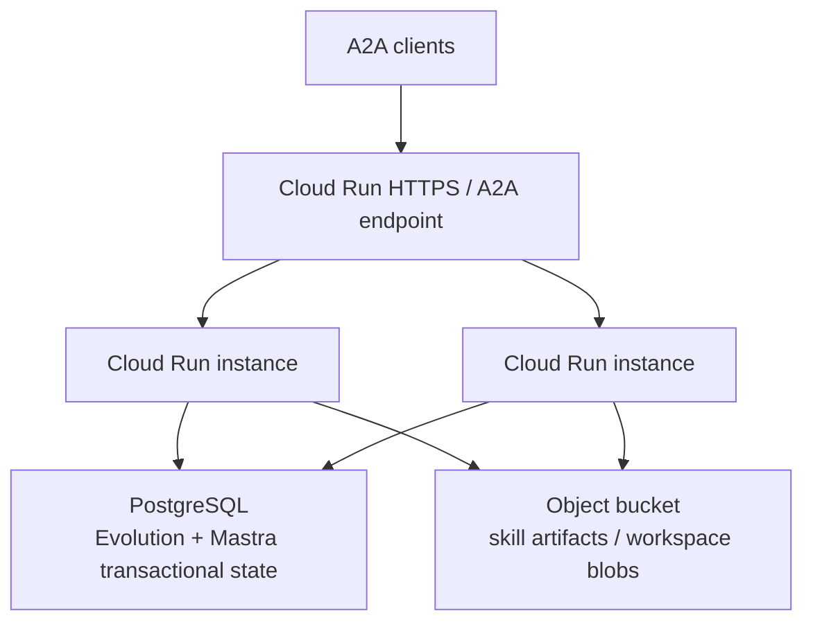

# Cloud Run + A2A example

Typechecked wiring for Mastra Evolution on Cloud Run. Instances share **PostgreSQL** for Evolution state and an **object bucket** for skill artifacts. A2A is the client transport; Evolution stays transport-agnostic.

This example does **not** open a real database. `src/index.ts` uses a `SqlExecutor` stub so it compiles without `pg` or `@mastra/core`. Without `DATABASE_URL`, `main()` prints a skip message and returns.

## Architecture



- **PostgreSQL** (`DATABASE_URL`): evidence, lessons, proposals, events. Optimistic concurrency on proposal version prevents two instances from publishing conflicting skill revisions (`VersionConflictError`).
- **Object bucket** (`ARTIFACT_BUCKET`): immutable/versioned skill blobs and workspace files.
- **A2A**: Mastra serves Agent-to-Agent. Evolution reads thread, resource, and trace context from the agent call; it does not parse A2A frames.

## Warning: do not use Cloud Storage FUSE as a SQLite/LibSQL database

Cloud Run can mount a Cloud Storage bucket via FUSE. That mount is **not** a POSIX disk:

- no file locking for concurrent writes
- last writer wins
- not fully POSIX compliant

**Do not** put a SQLite or LibSQL Evolution (or Mastra) database on a GCS FUSE volume. Use PostgreSQL (or another transactional store) for multi-instance state. Use the bucket for artifacts only.

See [Cloud Storage volume mounts](https://docs.cloud.google.com/run/docs/configuring/services/cloud-storage-volume-mounts) and `docs/architecture/cloud-run.md`.

## Environment

Copy `env.example` and set at least:

| Variable                    | Purpose                                                                 |
| --------------------------- | ----------------------------------------------------------------------- |
| `DATABASE_URL`              | PostgreSQL URL for Evolution state. Skip runtime connection when unset. |
| `ARTIFACT_BUCKET`           | Object bucket for skill artifacts                                       |
| `MASTRA_CLOUD_ACCESS_TOKEN` | Mastra Cloud / API token when used                                      |
| `MASTRA_AGENTS_BASE_URL`    | Agent HTTP/A2A base URL                                                 |
| `MASTRA_A2A_PATH`           | A2A path (default `/a2a` in the example file)                           |

## Run (compile)

```bash
pnpm --filter @mastra-evolution/example-cloud-run-a2a build
pnpm --filter @mastra-evolution/example-cloud-run-a2a start
```
